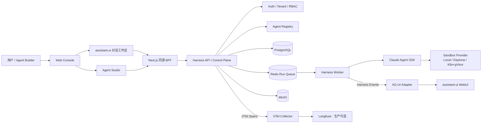

# Claude Agent Harness

> Claude Agent SDK 为执行内核的生产级智能体平台。把 Agent 从"定义、验证、运行到运营"的完整生命周期标准化：Agent 代码只关注业务能力，平台负责会话、审批、沙箱、版本治理、评测与可观测。

## 生态定位

Claude Agent SDK 提供了 Agent Loop、内置工具、子 Agent、Skills、MCP、Hooks 和 Session Resume，但**不提供**多租户服务、Agent 版本治理、分布式任务、审批恢复、统一 API、WebUI 与生产级可观测性。本项目在 SDK 之上补上这些层：

| 层 | SDK 提供 | Harness 补齐 |
| --- | --- | --- |
| 执行内核 | Claude Agent SDK Tool Loop、SessionStore、流式消息 | — |
| 隔离计算 | Sandbox（本地） | 多 Provider 抽象：Local / Daytona / E2B / Kubernetes+gVisor（只读根文件系统、无 Token ServiceAccount、默认拒绝网络、allowlisted egress proxy） |
| 服务层 | — | FastAPI 控制面：Agent Registry、Session/Run/Approval/Artifact、Auth/Tenant/RBAC、Event Query |
| 编排与持久化 | Session 恢复 | PostgreSQL + Redis 队列（visibility lease/心跳/崩溃回收）、幂等 Run、fencing token、状态机、审批暂停/过期/恢复、Workspace 快照（MinIO） |
| 可观测 | — | 应用只发 OpenTelemetry；生产经 Collector 输出到 Langfuse；内建 Eval/Quality 门禁与审计 |

开发一个新 Agent，主要工作变成"写 Manifest + prompt/skills/tools + 受控业务 MCP"，而不是重建会话、审批、网关、事件流、存储和 UI。Python SDK MCP 只适用于 Claude CLI 与 Worker 同进程的受信本地模式；生产 Daytona 或 Kubernetes/gVisor 模式应使用带执行身份认证的 HTTP MCP。

## 核心能力

- **Manifest 驱动的 Agent 定义**：agent.yaml 固化 prompt、tools、skills、subagents、权限与预算；平台负责 Session、Run、Workspace、Artifact 与失败恢复。
- **不可变版本治理**：Agent Draft 可编辑，`AgentVersion` 一旦发布不可覆盖；确定性 ZIP bundle + 内容哈希，发布门禁校验 Prompt/Skills/eval 覆盖/策略兼容/无秘密/可复现。
- **Lead + Sub Agent**：固定一层委派图，Lead 保持对话所有权，Sub 是受限专业执行单元，角色别名 + 固定版本 + 独立轮次上限。
- **显式能力与默认拒绝**：`有效权限 = 用户/租户权限 ∩ Manifest 声明 ∩ 服务端 Permission Profile ∩ Sandbox 事实 ∩ Run 上下文`；任一层不允许，工具都不能执行。Sandbox 隔离不能扩大 Manifest 权限，Prompt 不能绕过 Policy。
- **工具审批生命周期**：allow / deny / ask 策略，审批可暂停、过期、拒绝或恢复；`PreToolUse` 在真实 SDK 执行前完成策略判定。API/Worker 间的审批决策通过耐久 Repository 传播。
- **模型网关**：new-api 等 Anthropic-compatible 网关优先（`ANTHROPIC_BASE_URL`/`ANTHROPIC_AUTH_TOKEN` 注入），能力不满足时只走 Manifest 显式声明的官方回退，绝不静默切换。
- **异步 Run + 实时事件**：SSE/AG-UI 事件脊柱，取消、中途追加消息、浏览器流中止全链路（Run 终态 `cancelled`）。
- **事实先于界面**：PostgreSQL 中的 Run/Event/Approval/Artifact 是权威事实；AG-UI 只是无状态投影，assistant-ui 控制台可替换而不影响 Agent 执行层。
- **输入与制品**：文件以只读方式挂载进本次 Run 的 `inputs/`，生成文件成为耐久 Artifact（MinIO）可预览/下载/审计；浏览器路径、内联字节和伪造 URL 不会被信任为工作区输入。
- **提示注入防护**：外部网页工具成功返回后把上下文单调标记为 `untrusted`，阻止注入内容进入长期记忆。
- **可观测但不绑定厂商**：应用只发 OpenTelemetry；生产可由 Collector 输出到 Langfuse，本地默认完全关闭 exporter。

## 架构

平台按四个平面组织，而不是按某个 UI 页面组织：

1. **定义平面**：Agent Studio、能力目录、Draft、Bundle、Version
2. **质量平面**：静态校验、真实 Preflight、离线 Eval、在线 Score
3. **运行平面**：API、队列、Worker、SDK、Sandbox、Tools、MCP
4. **运营平面**：Deployment、环境晋级、Trace、告警、审计、回滚



控制面（FastAPI Gateway）与执行面（Worker / Run Orchestrator）分离；业务状态在 PostgreSQL，队列/事件/锁在 Redis，附件/工作区快照/产物在 MinIO。完整方案见 [docs/agent-production-platform-design.md](docs/agent-production-platform-design.md)。

## 内置 Agent 包

| Agent | 定位 | 亮点 |
| --- | --- | --- |
| `echo-agent` | 正式验证包 | 只依赖模型网关即可运行，覆盖 Read/Glob/Grep/Write/Edit/Bash/Task 全链路 |
| `lead-agent` | 用户入口协调者 | 拆解任务、选择专家、验收结果，持有对话所有权 |
| `helper-agent` | 受限通用子 Agent | 只读工具 + 委托式调研 |
| `govdoc-writer-agent` | 党政公文撰写 | GB/T 9704-2012 公文格式 + docx 模板引擎 + 15 种文种 schema |
| `public-opinion-agent` | 舆情分析 | 只读 Tavily MCP + 风险分级 rubric + 报告契约 |
| `similar-case-analysis-agent` | 类案检索分析 | 案例技能索引 + 检索 |
| `networked-knowledge-research-agent` | 多源联网调研 | multi-source research skill |
| `archive-assistant-agent` / `archive-file-classifier-agent` | 档案整理 | 分类契约 + 归档规则 skills |

## 快速开始

环境要求：Python 3.12+、[uv](https://docs.astral.sh/uv/)、Node.js 18+、Docker（本地依赖栈）。

```bash
# 1. 安装后端依赖
uv sync --group dev

# 2. 初始化并检查一个 Agent（manifest + prompt/skills + evals）
uv run harness agent init invoice-reviewer --template analyst --domain accounts-payable
uv run harness agent check agents/invoice-reviewer/agent.yaml --environment production
uv run harness agent pack agents/invoice-reviewer/agent.yaml --output dist/agents

# 3. 安装前端依赖（构建默认使用 npmmirror，可在 npm 配置中覆盖）
cd web/harness-console && npm ci && cd ../..

# 4. 启动本地全栈（PostgreSQL + Redis + MinIO + API + Web；Fake Runtime）
make dev-up
```

打开：

- Harness API / Swagger: <http://127.0.0.1:8000/docs>
- Harness Console: <http://127.0.0.1:3000>
- MinIO Console: <http://127.0.0.1:9001>

停止：`make dev-down`。

本地栈只有 PostgreSQL、Redis、MinIO，**不包含 Langfuse 或 OTel Collector**（`make dev-up` 显式设置 `HARNESS_OTEL_ENABLED=false`）。使用 cc-switch 当前已应用的 Claude Provider 启动真实模型模式：

```bash
make dev-up-cc-switch
```

该命令只在 API 启动时读取 `~/.claude/settings.json`，不会把网关令牌写入项目；cc-switch 切换 Provider 后需要重启 Harness。

### 生产形态（Docker Compose）

```bash
cp deploy/docker-compose/.env.docker.example deploy/docker-compose/.env.docker
# 编辑 .env.docker：网关/数据库密钥、Sandbox Provider（daytona / kubernetes）
make docker-build
make docker-up
```

Compose 包含 API、Worker、Web、PostgreSQL、Redis、MinIO、migration 与可选 Langfuse Collector（`docker compose --profile observability up -d`）。构建默认使用清华 PyPI 与 npmmirror，可通过 `.env.docker` 覆盖。Kubernetes/gVisor per-run Pod 部署见 [docs/deployment.md](docs/deployment.md) 与 `deploy/helm/agent-harness`。

## 验证

```bash
make verify       # lint + typecheck + agent 生产门禁 + 确定性 + readiness + pytest
make agent-pack   # 为通过门禁的 Agent 生成确定性 ZIP
make e2e          # 无模型密钥 E2E：Manifest 发布、Session/Run、SSE/AG-UI、审批、恢复、Artifact 哈希、终态
make web-test
make web-build
```

无模型密钥的 E2E 会验证：Manifest 发布、Session/Run、SSE/AG-UI、工具审批、恢复、Artifact 下载与哈希、终态成功，以及本地 OTel exporter 关闭。`make verify` 还会对 `agents/*/agent.yaml` 执行生产门禁；生产发布 API 只接受 `/v1/agents/bundles`，不会读取客户端提交的服务器本地路径。

Web 首页直接使用 assistant-ui 的 Thread、Composer、Attachment 与 Markdown primitives，并通过官方 AG-UI runtime adapter 连接 Harness。主对话以一行可展开的执行条呈现工作摘要、工具和子 Agent，JSON/代码/Diff 使用结构化卡片；“运行详情”提供 Harness 事件脊柱与模型、Provider、时长、轮次、成本、停止原因。`make dev-up` 使用 Fake Runtime；`make dev-up-cc-switch` 使用当前 cc-switch Provider。两种模式都会幂等发布 `helper-agent@1.0.0` 与正式验证包 `echo-agent@0.4.1`。以下审批与产物标记仅用于 Fake Runtime 验收：

```text
[approval] [artifact] 验证完整流程
```

`echo-agent@0.4.1` 显式声明 `Read/Glob/Grep/Write/Edit/Bash/Task`，只配置模型网关即可运行；需要联网检索的领域包（例如 `public-opinion-agent`）再显式声明 `mcp: tavily-readonly`。`Write/Edit` 仅能操作本次 Run 的 workspace，默认自动允许；`Bash` 因进程环境、模型网关凭据和网络出口风险仍需网页审批。Manifest 始终是工具能力上限，Sandbox 策略不能给 Agent 注入未声明工具。

new-api 实际连通性是显式的可选 smoke（未提供变量时安全跳过）：

```bash
NEW_API_BASE_URL=https://gateway.example/api \
NEW_API_KEY=... \
NEW_API_MODEL=claude-sonnet-4-6 \
uv run python scripts/smoke_new_api.py
```

详细说明见 [docs/local-development.md](docs/local-development.md)。

## 目录结构

```text
agents/            领域 Agent 包（agent.yaml + prompts + skills + evals）
src/harness/       Harness 核心
  api/            FastAPI 控制面路由（agents/runs/sessions/approvals/artifacts/auth/...）
  application/    应用服务层
  core/           领域模型、状态机、端口抽象、Manifest、快照
  runtime/        Agent Runtime（Claude Agent SDK）与 Sandbox Provider
  worker/         异步 Worker（Run 编排、队列消费）
  auth/           JWT + RBAC + 审计
  evals/ quality/ 离线评测与线上质量门禁
  deployments/    环境、灰度、快照与回滚
  studio/         Agent Studio 定义平面（Draft / Catalog / Preview / Publish）
  knowledge/      知识库连接器与检索
  memory_bank/    用户 / Agent 级版本化记忆
  observability/  OpenTelemetry 输出
web/harness-console/  assistant-ui + AG-UI Web 控制台（Next.js 16 / React 19）
deploy/           Docker Compose、Dockerfile、Helm chart、OTel Collector、Prometheus
docs/             总体设计、部署、runbooks 与分期计划
tests/            单元 + 集成测试（PostgreSQL / Redis / MinIO 契约验证）
```

## 发布

采用"构建一次、签名固化、按环境晋级"的不可变流程：tag `v*` 触发 [release.yml](.github/workflows/release.yml)（质量门禁 → 构建 API/Web/Sandbox 三镜像 → 确定性 Agent bundle → SBOM → Trivy 扫描 → keyless 签名 → 上传 release artifact），随后 [promote.yml](.github/workflows/promote.yml) 按 `test → canary → production` 晋级。详见 [docs/runbooks/release-promotion.md](docs/runbooks/release-promotion.md) 与 [docs/runbooks/release-0.1.0-checklist.md](docs/runbooks/release-0.1.0-checklist.md)。

## 文档导航

- [总体设计](docs/agent-production-platform-design.md)：架构、Lead/Sub、记忆、安全、评测、发布与实施路线
- [Agent Studio 控制面](docs/agent-studio.md)：Draft 编译、发布门禁、RBAC 边界
- [团队空间与 RBAC](docs/team-spaces.md)：个人 Agent、团队租户、共享版本/知识库与任务隔离
- [领域 Agent 指南](docs/domain-agents.md)：prompt、Skill、Python Tool、外部 MCP、权限、bundle 发布与评测
- [单 Agent 上线检查](docs/production-agent-runbook.md) / [外部 Agent 暴露](docs/external-agent-exposure.md)
- [部署](docs/deployment.md) / [本地开发](docs/local-development.md) / [认证](docs/authentication.md)
- [Runbooks](docs/runbooks/)：发布晋级、平台可靠性、回滚与灾难恢复

## 当前边界

已具备持久化生产组合根、API 服务 Bearer、带 visibility lease/心跳/崩溃回收的 Redis Run 队列，以及 Docker Compose 和 Kubernetes/gVisor per-run Pod 两条部署基线。gVisor Pod 使用只读根文件系统、临时写层、无 Token ServiceAccount、默认拒绝网络和 allowlisted egress proxy；TTL Reaper 回收 Worker 崩溃遗留实例。Helm 资产与集群 opt-in E2E 见 `deploy/helm/agent-harness` 和 `tests/integration/sandbox/test_kubernetes_gvisor_live.py`。平台仍需补齐租户配额/计费与长期事件订阅。主 Agent 能解析 builtin、受信本地 Python SDK MCP 和服务端注册的外部 HTTP MCP，并通过 `PreToolUse` 在真实 SDK 执行前完成基于可信 Sandbox 隔离级别、Run 上下文信任等级的策略与审批；外部网页工具成功返回后把上下文单调标记为 `untrusted`，阻止提示注入内容进入长期记忆。远程 Sandbox 拒绝无法跨进程传递的 `python_entry`，而不是静默丢失工具。

## License

[Apache-2.0](LICENSE)
