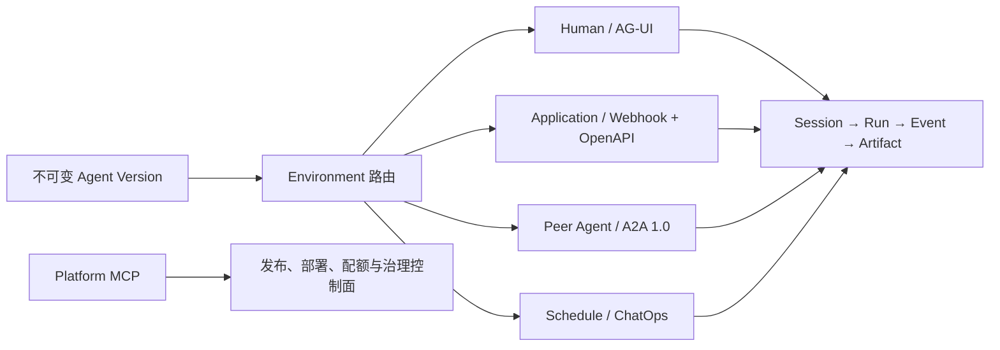

# Agent 对外能力体系

Agent Studio 发布后的 Agent 不是单独启动一套业务服务，而是由多个协议适配器共享同一条
`Session -> Run -> Event -> Artifact` 生命周期。环境路由负责选择不可变 Agent Version；
Webhook、A2A、AG-UI、ChatOps 和定时任务都只创建或投影 Harness Run，不维护第二套任务状态。



## 能力矩阵

| 使用方 | 首选入口 | 发现方式 | 任务与输出 |
| --- | --- | --- | --- |
| Harness Console / 人类用户 | `/v1/agui` | 平台内置 | Thread、Run、SSE、Artifact |
| 普通后端、自动化与 SaaS | Webhook Trigger | 每个 Trigger 的 `openapi.json` | 202 创建、状态、取消、事件 SSE、Artifact |
| 其他 Agent 或 Agent 平台 | A2A 1.0 Trigger | 每个 Trigger 的 Agent Card | Task、Context、History、Artifact、SSE |
| Slack、Teams、邮件等适配器 | ChatOps Trigger | 平台配置 | 归一化消息进入 Run |
| 周期任务 | Schedule Trigger | 平台配置 | 确定性调度键进入 Run |
| 平台运维 Agent | `/mcp/platform` | 短期工作负载令牌 | Agent、部署、配额和治理控制面 |

## Webhook：面向普通系统

创建 `kind=webhook` 的 Trigger 后，密钥只显示一次，且只能调用这个 Webhook 入口：

```text
GET  /webhooks/agent-triggers/{triggerId}/openapi.json
POST /webhooks/agent-triggers/{triggerId}
GET  /webhooks/agent-triggers/{triggerId}/runs/{runId}
POST /webhooks/agent-triggers/{triggerId}/runs/{runId}:cancel
GET  /webhooks/agent-triggers/{triggerId}/runs/{runId}/events
GET  /webhooks/agent-triggers/{triggerId}/runs/{runId}/artifacts/{artifactId}/content
```

- 调用使用 `Authorization: Bearer <trigger-secret>`。
- 创建 Run 必须提供 `Idempotency-Key`；相同键和相同输入收敛到同一个 Run，换输入复用会冲突。
- `events` 是支持 `Last-Event-ID` 的耐久 SSE 回放，断线不会取消 Run。
- OpenAPI 文档绑定当前环境实际路由到的 Agent Version，并通过 `ETag` 和 `Cache-Control`
  支持缓存。
- Artifact 下载仍在 Trigger 的租户、Trigger 和 Run 作用域内鉴权，不需要平台 API Bearer。

## A2A 1.0：面向其他 Agent

创建 `kind=a2a` 的 Trigger 后，直接配置发现地址为：

```text
GET /a2a/agent-triggers/{triggerId}/agent-card.json
```

Agent Card 从当前部署的不可变 Manifest 与 Skill 快照生成，包含实际 Agent Version、
`HTTP+JSON` 1.0 接口、Bearer SecurityScheme、输入输出模式和公开 Skill；卡片同样支持
`ETag` 与条件请求。

已实现的 A2A HTTP+JSON 操作：

```text
POST /message:send
POST /message:stream
GET  /tasks
GET  /tasks/{id}
POST /tasks/{id}:cancel
POST /tasks/{id}:subscribe
GET  /tasks/{id}/artifacts/{artifactId}/content
```

协议行为：

- 除 Agent Card 与其链接的 Artifact 下载外，请求必须携带 `A2A-Version: 1.0`；POST
  消息使用 `application/a2a+json`。
- `messageId` 是幂等键；服务端 Run ID 是 A2A Task ID，Session ID 是 Context ID。
- 未提供 `configuration.returnImmediately` 时，`message:send` 按 A2A 1.0 默认阻塞到终态或
  `AUTH_REQUIRED`；设为 `true` 时立即返回 `TASK_STATE_SUBMITTED` 或最新状态。
- 客户端可用服务端返回的 `contextId` 创建同一上下文中的新 Task。当前 Harness Run 不接受
  向已有 Task 追加输入，因此携带有效 `taskId` 会返回 `UNSUPPORTED_OPERATION`；未知 Task
  仍返回 `TASK_NOT_FOUND`。
- `GET /tasks` 支持 Context、状态、更新时间、分页、History 和 Artifact 过滤，并始终按最新
  状态时间倒序返回 Trigger 可见的 Task。
- 模型文本被投影为 `text/plain` Artifact；运行时文件 Artifact 使用 A2A Trigger 鉴权的绝对
  下载 URL。SSE 使用同一 Artifact ID 发送有序 `append/lastChunk` 文本块。
- A2A 专用错误采用 HTTP 状态对应的 Google RPC Status JSON，并用
  `google.rpc.ErrorInfo` 区分 `TASK_NOT_FOUND`、`TASK_NOT_CANCELABLE`、
  `CONTENT_TYPE_NOT_SUPPORTED`、`VERSION_NOT_SUPPORTED` 等语义。

当前不启用 A2A Push Notification。长任务应使用立即返回后轮询、`tasks/{id}:subscribe` 或
`message:stream`。如果以后启用 Push，必须先实现回调 URL 的 SSRF 防护、独立出站凭据、重试
与投递审计，再在 Agent Card 中声明能力。

## MCP 的职责边界

MCP 与 A2A 不是替代关系：

- Agent Manifest 中的 MCP 是 Agent 在执行 Run 时消费的工具与数据能力，属于“向内调用”。
- `/mcp/platform` 是受治理的管理控制面，供运维 Agent 查询发布、部署、配额和策略；它不代表
  某个业务 Agent 的对话接口。
- Agent 对 Agent 的任务委派、状态、流式进度和 Artifact 交换优先使用 A2A。

只有当外部客户端明确需要“把整个 Agent 当作一个 MCP Tool”时，才应增加单独的 Invocation
MCP Gateway；该网关也必须调用现有 Trigger/Run 服务，不能建立另一套会话与任务表。

## Bundle 的可逆交付

Studio Bundle 同时承担不可变发布包和跨环境交付包：

```text
GET  /v1/studio/drafts/{draftId}/bundle
POST /v1/studio/drafts/import        Content-Type: application/zip
```

新 Bundle 包含 `studio.json`，保存 Manifest 未覆盖的 Studio 元数据。导入会安全解包并重建
完整可编辑 Draft，包括 Prompt、Skill 文件、工具目录、子 Agent、权限、Workspace、Limits、
评测集和 Execution Profile；随后重新编译并验证完整包哈希，实现导出 → 导入 → 再导出的
字节级闭环。旧 Bundle 可兼容导入，但缺失的 Studio 元数据会明确返回 warning，且不会宣称
无损。

导入拒绝路径穿越、Symlink、不受支持的二进制 Skill、Python Entry Tool/Hook，以及无法完整
还原的子 Agent 定义。任何 Secret 都不得进入 Bundle。

## 生产网关与发布要求

- 公网入口必须使用 TLS；反向代理需要原样转发 `Authorization`、`A2A-Version`、
  `Idempotency-Key`、`Last-Event-ID`、Query String 和流式响应。
- 对 Agent Card 与 OpenAPI 描述允许缓存；任务、事件与 Artifact 响应不得被共享缓存。
- Trigger Secret 必须独立存储、可轮换、可停用，不能复用平台 API Bearer、用户 JWT 或 MCP
  工作负载令牌。
- API Gateway 应按 Trigger 限流，并记录认证失败、任务创建、取消、Artifact 下载和异常流量；
  日志不得记录 Secret、原始 Prompt 或 Artifact 正文。
- 环境晋级后，新 Context/Session 解析新部署；已有 Context 继续绑定创建时的不可变部署快照。
- 发布门禁至少运行 Python 全量测试、Pyright、Ruff、前端测试与生产构建、Bundle 确定性验证，
  再执行本地或容器化黑盒 Smoke。
