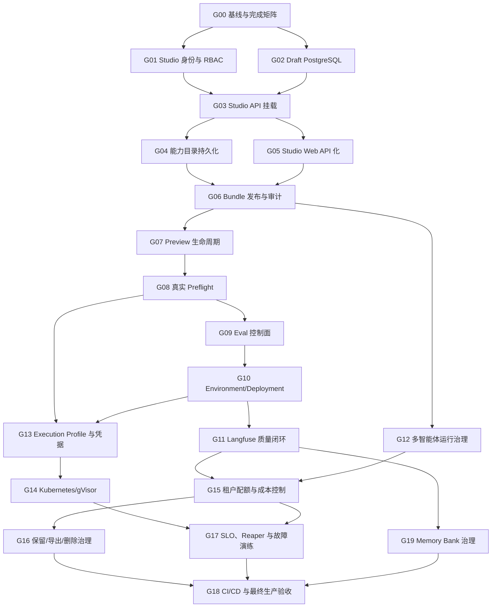

# Agent 生产平台 Goals 与执行 Loops

- **来源方案：** [`../agent-production-platform-design.md`](../agent-production-platform-design.md)
- **适用执行器：** Codex、Claude Code，以及具备持久 Goal/Loop 能力的代码 Agent
- **编制日期：** 2026-07-16
- **目标：** 把总体方案转换为可独立执行、可验证、可合并的工程任务树

## 1. 使用方式

本文不是普通 backlog。每个 Goal 都是一段可以直接交给 Codex 或 Claude 的完整工作
契约，包含：

- 明确目标和非目标；
- 前置依赖与并行边界；
- 权威代码和文档；
- 必须交付的纵向切片；
- 可执行验证命令；
- 完成审计所需证据；
- 发生失败后继续迭代的 Loop。

Codex 可以复制每个 Goal 的 `/goal` 代码块。Claude Code 可以复制代码块中 `/goal`
之后的正文作为长期任务提示。执行器不得把 Goal 缩小成“先写接口”“先做页面”后就宣称
完成。

## 2. Root Goal

```text
/goal
基于 docs/agent-production-platform-design.md，完成 Agent Harness 从当前生产运行基线到
完整 Agent Studio 生产线的建设。按
docs/plans/2026-07-16-agent-production-platform-goals-and-loops.md 中 G00～G19 的依赖
顺序执行；每个 Goal 必须满足自己的验收证据和完成审计后才能关闭。保留 Claude Agent
SDK 作为内层 Agent Loop，不以通用图编排器替代；所有未声明能力 fail closed；所有发布
对象不可变；页面不得伪造后端尚未具备的状态。最终完成 Studio 控制面、Preview、真实
Preflight、Eval、环境发布、Langfuse 质量闭环、运行治理、gVisor/Kubernetes、企业运营和
长期记忆治理，并通过全量自动化与真实部署验收。
```

Root Goal 只有在以下条件全部成立后才能标记完成：

1. G00～G19 均有完成审计和可复核证据；
2. 目标分支工作区干净，数据库 migration 只有一个线性 head；
3. Python、Web、Agent Package、Docker 和浏览器 E2E 全部通过；
4. 从创建草稿到生产发布、运行、审批、Artifact、Trace、Score 和回滚形成真实闭环；
5. 安全、租户隔离、恢复、取消和故障注入用例均通过；
6. 总体方案中的 `[待接入]` 已关闭，`[规划]` 要么落地，要么经架构决策明确移出 Root
   Goal，不得只因实现困难而省略。

## 3. 执行纪律

### 3.1 一个 Goal 一个纵向切片

一个 Goal 应包含完成该能力所需的领域模型、Repository、Service、API、必要 UI、测试和
文档。不能把数据库、后端和前端分别交付为长期不可用的半成品。

为了控制规模，允许同一个能力分为多个 Goal，但每个中间 Goal 必须有独立可验证结果，
例如：持久化 Draft Repository 可以在 UI 接入前通过 API 和重启测试独立验收。

### 3.2 权威状态优先

每轮开始必须重新检查：

```bash
git status --short --branch
git log -5 --oneline
rg --files | sort
```

然后读取 Goal 指定的权威文件、最新 migration、测试和运行状态。不得仅依赖上一次对话
摘要或设计意图判断当前是否已完成。

### 3.3 先写证据矩阵

执行器在动代码前应列出：

| 要求 | 权威证据 | 当前状态 | 缺口 |
| --- | --- | --- | --- |
| Goal 的每一条验收条件 | 文件、测试、API、页面或运行日志 | 已证明/矛盾/缺失 | 下一动作 |

测试通过只证明测试覆盖的要求。若测试没有覆盖租户隔离、重启恢复或真实浏览器行为，就不能
把窄测试当作完整证据。

### 3.4 分支和并行规则

- 每个 Goal 使用独立 feature branch/worktree；
- 同时只能有一个 Goal 新增 Alembic migration；
- 同时只能有一个 Goal 修改 `src/harness/api/app.py`、生产 composition root 或主导航；
- 并行 Goal 不得编辑同一数据模型或 API contract；
- 合并前先更新目标分支，重新运行 Goal 的全部门禁；
- 不使用 `git reset --hard`、覆盖他人工作区或删除未知变更；
- 每个 Goal 最终形成一个或少量意图清晰的提交。

### 3.5 完成与阻塞

- 只有验收项全部有直接证据时才完成；
- 不能因为预算、上下文或时间不足缩小 Goal；
- 外部凭据缺失时，先完成 Fake/Contract 测试和所有不依赖凭据的工作；
- 同一外部阻塞连续多轮且无安全替代路径时，记录精确阻塞条件和已尝试证据；
- 任何“暂时跳过”必须进入明确后续 Goal，不能从 Root Goal 静默消失。

## 4. 通用执行 Loops

### L0：所有 Goal 的基础循环

```text
Inspect
  -> 读取工作区、依赖 Goal 和权威文件
  -> 建立要求/证据/缺口矩阵
Plan
  -> 选择最小但完整的纵向切片
  -> 标明数据库、API、UI、运行时和兼容性影响
Implement
  -> 先补失败测试或契约测试
  -> 实现领域逻辑，再接适配器和界面
Verify
  -> 目标测试
  -> 相邻回归
  -> 全量相关门禁
  -> 真实 API/浏览器/容器验证
Audit
  -> 逐条核对 Goal 验收条件
  -> 检查安全、租户、幂等、失败和恢复路径
Persist
  -> 更新文档和 migration 说明
  -> 提交并输出可复核证据
  -> 若任何证据缺失，回到 Inspect 继续下一轮
```

### L1：控制面资源循环

适用于 Draft、Catalog、Preview、Eval、Deployment 等持久化资源。

1. 先定义不可变领域模型、状态机和唯一约束；
2. 先写 Repository Contract Test；
3. 同时实现 InMemory 与 PostgreSQL Adapter；
4. 新增单一线性 migration，并验证 upgrade；
5. Service 层处理租户、幂等、CAS 和状态转换；
6. API 只调用 Service，不直接写 Row；
7. 增加 401、403、404、409、422、重启恢复和跨租户测试；
8. 接入 UI 后再用浏览器验证 Loading/Empty/Error/Conflict/Success；
9. 完成审计后才进入下一资源。

### L2：Web 纵向循环

适用于 Studio、Preview、Eval、Deployment 页面。

1. 从真实 API Schema 生成或编写 Typed Client；
2. 先实现只读加载和错误边界；
3. 再实现写入、乐观并发、权限和恢复；
4. 页面只展示服务端事实，禁用未接通动作；
5. 单元测试覆盖状态转换和兼容迁移；
6. Next.js Build 通过；
7. 在已部署页面完成桌面和窄屏浏览器验收；
8. 控制台无错误，刷新不重复写入或创建 Run。

### L3：Runtime / Sandbox 循环

适用于多智能体、Execution Profile、gVisor 和凭据代理。

1. 先写安全不变量和失败语义；
2. 用 Fake Adapter 验证协议；
3. 实现真实 Adapter，但不在失败时回退到不安全 Local；
4. 在 PreToolUse 和 Worker 两条路径验证权限一致；
5. 注入取消、超时、网络失败、Worker 崩溃和陈旧租约；
6. 检查事件、Artifact、Trace 和终态收敛；
7. 有外部环境时运行 opt-in live smoke；
8. 明确报告未运行的外部 smoke，不伪造通过。

### L4：评测与可观测循环

适用于 Eval、Langfuse、Score 和发布门禁。

1. 先定义确定性结果 Schema；
2. 从耐久 Run/Event 评分，不从 UI 文本猜测；
3. 持久化 Dataset、Run、CaseResult 和版本关联；
4. OTel 只输出 allowlist 属性；
5. 用 InMemory Exporter 验证 Trace 结构和脱敏；
6. 用 Fake Langfuse/Collector 验证请求协议；
7. 再做真实 Langfuse opt-in smoke；
8. LLM Judge 只能辅助，不能单独自动回滚。

### L5：发布与运营循环

适用于 Environment、Promotion、Rollback、Kubernetes 和 SLO。

1. 先固定版本、镜像和配置快照身份；
2. 所有 reconcile 操作可幂等重试；
3. Promotion 只切指针或流量，不重写 AgentVersion；
4. Rollback 使用已经验证的历史快照；
5. 为卡住状态提供 Reaper 和人工处置；
6. 增加失败注入、回滚和审计测试；
7. 运行部署 smoke、健康检查和浏览器验证；
8. 记录 SLO 指标和容量上限。

## 5. 依赖图与执行波次



### 推荐波次

| 波次 | Goals | 并行说明 |
| --- | --- | --- |
| W0 | G00 | 独占基线和文档 |
| W1 | G01、G02 | 可并行；G01 不新增 migration，G02 独占 migration |
| W2 | G03 | 独占 API composition root |
| W3 | G04、G05 | 可并行；分别以后端目录和 Web 为主 |
| W4 | G06 | 发布闭环合流 |
| W5 | G07、G12 | 可并行；G07 控制面，G12 Runtime |
| W6 | G08 | 真实环境预检 |
| W7 | G09 | Eval 持久化和 UI |
| W8 | G10 | Deployment 状态机和 migration |
| W9 | G11、G13 | 允许并行，但 G13 migration 必须先确认 G11 不新增 migration |
| W10 | G14、G15 | 可并行；基础设施与配额域分离，G15 独占 migration |
| W11 | G16 | 数据保留/导出/删除，独占 migration |
| W12 | G17、G19 | 可并行；运营可靠性与记忆域分离，G19 独占 migration |
| W13 | G18 | CI/CD 和最终全链路验收 |

## 6. Goal Cards

### G00：建立可复核执行基线

- **优先级：** P0
- **依赖：** 无
- **Loop：** L0
- **建议分支：** `chore/platform-execution-baseline`
- **完成证据：** [`2026-07-16-agent-production-platform-g00-baseline.md`](2026-07-16-agent-production-platform-g00-baseline.md)

**目标**

冻结当前真实能力基线，把总体方案、执行任务树、现有测试和部署状态变成后续 Goal 可共同
引用的权威起点。

**交付物**

- 提交当前总体方案和 Goals/Loops 文档；
- 建立设计章节到 Goal 的覆盖矩阵；
- 记录当前 migration head、测试数量、Docker 服务和已知外部 smoke；
- 确认 develop/目标分支合并策略和下一 migration 编号；
- 工作区不包含 Secret 或未知生成物。

**验收证据**

- `git status` 干净；
- 总体设计和本文相互链接；
- `make verify`、`make web-test`、`make web-build` 或等价命令结果被记录；
- Agent Package check 全部通过；
- Docker API/Web/Worker 健康检查通过；
- 基线报告明确区分通过、跳过和因端口/凭据未运行的测试。

```text
/goal
完成 G00：以当前工作树为权威，提交 Agent 生产平台总体设计和 Goals/Loops，建立覆盖矩阵
和可复核基线。运行 Python、Web、Agent Package 和 Docker 健康验证；不得把缺少外部凭据
的 smoke 写成通过。确认 migration head 和后续分支/合并顺序，最终工作区干净并输出逐项
证据。
```

### G01：Studio 身份与细粒度 RBAC

- **优先级：** P0
- **依赖：** G00
- **Loop：** L1
- **建议分支：** `feature/studio-rbac`

**目标**

把已经验证的 Harness `Identity` 安全映射为 Studio Actor，并建立
`studio:read / studio:write / studio:preview / studio:publish / studio:deploy` 权限。

第一阶段不扩展 Membership Role 枚举；推荐映射：viewer 只读、member 可读写和预览、
admin 可发布和部署、owner 全权限。未来自定义角色在 G18 处理。

**非目标**

- 不挂载 Studio Router；
- 不新增 Draft 表；
- 不让前端通过 Header 自报 Studio 身份。

**权威文件**

- `src/harness/auth/models.py`
- `src/harness/api/dependencies.py`
- `src/harness/studio/api.py`
- `tests/unit/api/`、`tests/unit/studio/`

**验收证据**

- JWT 和服务身份均产生服务端可信 Actor；
- 未登录返回 401，权限不足返回 403；
- viewer/member/admin/owner 权限矩阵有参数化测试；
- Actor tenant/user 不能被请求体或 Header 覆盖；
- 现有任务权限无回归。

```text
/goal
完成 G01：为 Agent Studio 接入服务端可信 Identity 和细粒度权限，不挂载 Router、不新增
数据库表。按 viewer/member/admin/owner 映射 studio 权限，删除或替换任何依赖前端自报
StudioActor 的路径。用参数化测试证明 401/403、租户不可伪造和现有 RBAC 无回归；完成
逐条审计后提交。
```

### G02：Agent Draft PostgreSQL 持久化

- **优先级：** P0
- **依赖：** G00
- **Loop：** L1
- **建议分支：** `feature/studio-draft-postgres`

**目标**

实现 tenant-scoped PostgreSQL `AgentDraftRepository`，替换仅用于测试的内存草稿存储，
保留 `expectedRevision` 乐观并发语义。

**交付物**

- `AgentDraftRow` 和下一线性 Alembic migration；
- PostgreSQL Repository；
- InMemory/PostgreSQL 共享 Contract Tests；
- 生产 composition 可构造该 Repository，但暂不挂载 Router；
- 草稿 JSON schema 演进策略。

**验收证据**

- create/get/list/replace 均强制 tenant scope；
- 同名或相同 draft ID 的跨租户数据不冲突；
- stale revision 返回 Conflict；
- 数据库/进程重启后草稿仍存在；
- migration upgrade 通过，模型与 DB Schema 一致；
- 并发更新只有一个成功。

```text
/goal
完成 G02：新增 tenant-scoped AgentDraft PostgreSQL Repository 和单一线性 migration，
保持 expectedRevision CAS。先写共享 Repository Contract Tests，再实现 Adapter；证明跨租户
隔离、并发冲突和重启持久化。不要挂载 Studio Router，不要把草稿 Secret 写入数据库；
完成 migration 与回归审计后提交。
```

### G03：Studio API 主应用挂载

- **优先级：** P0
- **依赖：** G01、G02
- **Loop：** L1
- **建议分支：** `feature/studio-api-composition`

**目标**

把 `/v1/studio` Router、Studio Service、PostgreSQL Repository、Compiler 和现有
Agent Publisher 接入生产 `ApiContainer` 与 FastAPI 主应用。

**交付物**

- production/memory composition 都能构造 Studio Service；
- Router 挂载；
- capabilities、draft CRUD、validate、bundle API 可用；
- 身份和权限依赖使用 G01；
- OpenAPI 和错误模型保持稳定。

**验收证据**

- API Contract Tests 覆盖 200/201/401/403/404/409/422；
- 跨租户 Draft 以 404 隐藏；
- 重启后读取同一 Draft；
- 下载 Bundle 文件名、媒体类型和内容哈希正确；
- 生产组合根启动/关闭资源无泄漏；
- 现有 `/v1/agui`、auth、runs 无回归。

```text
/goal
完成 G03：把 Studio Service 和 Router 挂载到真实 ApiContainer/FastAPI，使用 G01 身份权限
和 G02 PostgreSQL Draft Repository。实现从 capabilities 到 bundle 的完整 API Contract，
验证错误码、跨租户隐藏、重启恢复和资源关闭。不要在此 Goal 实现 Web 或发布按钮；全量
API 回归通过后提交。
```

### G04：持久化能力目录

- **优先级：** P0
- **依赖：** G03
- **Loop：** L1
- **建议分支：** `feature/studio-capability-catalog`

**目标**

把静态 Model/MCP/Policy/Execution Profile 目录升级为平台管理的持久化 Catalog，同时
保持 Agent Draft 只引用逻辑 ID 和 Secret Reference。

**交付物**

- ModelRoute、MCPRegistration、PolicyMetadata、ExecutionProfileMetadata 领域模型；
- Repository 与 migration；
- Admin CRUD / 普通 Builder 只读 API；
- 默认内置 Catalog 幂等 Seed；
- Catalog 版本/禁用状态和影响检查；
- Studio Compiler 从 Repository Catalog 校验。

**非目标**

- 不在数据库保存明文 Secret；
- 不实现 gVisor；
- 不允许 Builder 输入任意 MCP URL。

**验收证据**

- Catalog 重启持久化且 Seed 幂等；
- Builder 不能创建/修改 Registration；
- Draft 引用未知、禁用或能力不兼容资源时校验失败；
- 已发布 AgentVersion 不受 Catalog 后续修改影响；
- API/日志/Trace 不出现 Secret 值。

```text
/goal
完成 G04：持久化 Studio 能力目录，覆盖 ModelRoute、MCP、Policy 和 Execution Profile
元数据。提供 Admin CRUD、Builder 只读和幂等 Seed；Draft 只能引用逻辑 ID，任何明文
Secret、任意 Header 或 URL 都必须拒绝。用重启、禁用、兼容性和权限测试完成审计后提交。
```

### G05：Studio Web 从浏览器草稿迁移到 API

- **优先级：** P0
- **依赖：** G03
- **Loop：** L2
- **建议分支：** `feature/studio-web-api`

**目标**

把 `/studio/agents` 从静态目录和 localStorage 主数据切换为租户 Studio API，同时保留一次
旧草稿迁移、乐观并发冲突和离线错误恢复。

**交付物**

- Studio Typed Client/BFF；
- 服务端 Draft/Version 列表；
- create/edit/save/validate/download bundle；
- revision conflict UI；
- localStorage 旧草稿一次性导入或明确丢弃；
- Loading/Empty/Error/Unauthorized/Forbidden 状态；
- 权限控制按钮。

**验收证据**

- 页面刷新后数据来自 API，不回退成假列表；
- 两个浏览器同时编辑能显示 409 冲突；
- 旧草稿迁移不崩溃且不会重复导入；
- viewer 只读，member 可编辑，未登录跳转登录；
- 单元测试、Next Build 和真实浏览器验收通过；
- 控制台无错误，窄屏可用。

```text
/goal
完成 G05：将 Agent Studio 页面切换到真实 Studio API，保留旧 localStorage 草稿的一次性
安全迁移。实现目录、编辑、保存、校验、Bundle 下载、权限和 409 冲突 UI；所有列表必须
来自服务端，不得保留假 Agent。运行前端测试、构建和真实浏览器桌面/窄屏验收，控制台
无错误后提交。
```

### G06：授权发布、不可变版本与审计闭环

- **优先级：** P0
- **依赖：** G04、G05
- **Loop：** L1 + L2
- **建议分支：** `feature/studio-publish-audit`

**目标**

接通 Studio Publish，使通过生产门禁的 Draft 发布为不可变 AgentVersion，并在 API、审计
和 UI 中完整呈现发布结果。

**交付物**

- `studio:publish` 权限；
- Studio Publisher 使用现有 `AgentService.publish_bundle`；
- 发布前 Catalog、Package 和依赖版本复验；
- Draft 回写 published version/hash；
- AuditEntry 记录 actor、draft、version、hash、结果；
- UI 启用发布并展示不可覆盖语义和错误。

**验收证据**

- member 不能发布，admin/owner 可以；
- 相同 `name@version` 不同内容返回冲突；
- 相同幂等发布不会生成重复版本；
- Sub Agent 未发布或版本漂移时拒绝；
- 审计不含 Prompt、Secret 和文件正文；
- 浏览器发布后目录显示真实已发布版本。

```text
/goal
完成 G06：接通 Studio 授权发布，必须经过 Catalog、生产 Package 和固定依赖复验，并复用
AgentService 生成不可变 AgentVersion。实现发布权限、幂等、冲突、Draft 回写、脱敏审计
和真实 UI 状态；用 API、数据库和浏览器证据证明完整闭环后提交。
```

### G07：Preview Deployment 与 TTL 回收

- **优先级：** P1
- **依赖：** G06
- **Loop：** L1 + L5
- **建议分支：** `feature/studio-preview-deployment`

**目标**

实现草稿内容哈希绑定的短生命周期 Preview 资源，为真实 Preflight 和人工试跑提供隔离
环境，但不创建正式 AgentVersion。

**交付物**

- Preview 领域模型、状态机、Repository 和 migration；
- create/get/list/cancel API；
- `draftRevision + contentHash + actor + expiresAt`；
- Redis Job 和 Worker Controller；
- TTL Reaper；
- Studio 生命周期 UI；
- 测试数据和生产数据隔离标识。

**验收证据**

- 相同幂等键不创建重复 Preview；
- Draft 更新后旧 Preview 明确标记 stale；
- TTL 到期自动回收并进入 terminal status；
- 取消最终收敛；
- Preview 失败不产生 AgentVersion；
- 重启/Worker 崩溃后 Controller 可恢复。

```text
/goal
完成 G07：实现与 Draft revision/content hash 绑定的 Preview Deployment、状态机、队列任务、
取消和 TTL Reaper。Preview 必须使用测试身份和隔离环境，失败不能创建正式版本。用幂等、
stale、过期、崩溃恢复和 UI 生命周期证据完成审计后提交。
```

### G08：真实 Sandbox / Model / MCP Preflight

- **优先级：** P1
- **依赖：** G07
- **Loop：** L3
- **建议分支：** `feature/studio-live-preflight`

**目标**

在 Preview 中执行目标环境真实 Preflight，验证模型、Tool Use、Sandbox、MCP、审批、文件
和 Artifact，不再把静态 Schema 校验当成可部署证明。

**交付物**

- 版本化 PreflightCheck/Result Schema；
- Model streaming/tool-use 检查；
- Sandbox provision/prepare/collect/destroy；
- MCP initialize/tools-list/只读 smoke；
- Workspace 输入、Write/Edit/Bash 审批和 Artifact；
- 结果 Event、API 和 Studio UI；
- Secret 全链路脱敏。

**验收证据**

- Fake Preflight 覆盖每个失败阶段；
- Daytona opt-in smoke 在有配置时通过；
- MCP 不可达、工具不匹配、模型不兼容均给出稳定错误码；
- 错误不会静默回退 Local Sandbox；
- 取消/超时最终收敛并清理资源；
- Trace 和日志不含 Secret。

```text
/goal
完成 G08：在 Preview 中实现真实 Model、Sandbox、MCP、审批、文件和 Artifact Preflight。
先用 Fake 覆盖全部失败阶段，再运行可用的 Daytona/MCP opt-in smoke；任何失败不得回退
不安全 Local。实现稳定结果 Schema、Event、UI 和脱敏 Trace，完成取消/超时/清理审计后
提交。
```

### G09：持久化 Eval 控制面

- **优先级：** P1
- **依赖：** G08
- **Loop：** L1 + L4 + L2
- **建议分支：** `feature/studio-evaluation-control-plane`

**目标**

把现有 CLI `EvalRunner` 升级为可排队、持久化、查看和阻断发布的 Eval 控制面。

**交付物**

- EvalDatasetVersion、EvalRun、EvalCaseResult 模型与 migration；
- 队列任务和 Worker；
- 复用现有 Run/Event 确定性评分；
- API：create/get/list/cancel；
- JSON/JUnit/Artifact 输出；
- Studio 用例、进度、失败证据和版本对比 UI；
- Agent/Preview/Environment 关联。

**验收证据**

- 每个 Case 使用独立 Session 和稳定幂等键；
- 一个 Case 基础设施失败不会终止整套；
- 超时 Case 会取消服务端 Run；
- 断言终态、required/forbidden tools、approval、output、duration；
- 重启后 EvalRun 和结果仍存在；
- 未通过必需 Dataset 的版本不能晋级。

```text
/goal
完成 G09：将现有 EvalRunner 变成耐久 Eval 控制面，新增 DatasetVersion、EvalRun、
CaseResult、队列、API 和 Studio UI。评分必须来自 Run/Event，Case 互相隔离并支持取消、
重启恢复、JSON/JUnit。用确定性断言和发布阻断证据完成审计后提交。
```

### G10：Environment、Deployment、Promotion 与 Rollback

- **优先级：** P1
- **依赖：** G09
- **Loop：** L1 + L5 + L2
- **建议分支：** `feature/agent-deployment-lifecycle`

**目标**

实现 test、canary、production 环境中的不可变版本部署、流量切换、晋级和回滚。

**交付物**

- Environment、Deployment、DeploymentRevision/Snapshot 模型与 migration；
- 状态机和 reconcile job；
- 发布包 hash、镜像摘要、Execution Profile、非敏感配置快照；
- promote/rollback API；
- 新 Session 解析环境当前版本，已有 Session 保持固定版本；
- Studio Deployment 页面和版本 Diff；
- 审计记录。

**验收证据**

- Promotion 不修改 AgentVersion；
- 同一操作可安全重试；
- canary 流量只影响新 Session；
- Rollback 使用历史已验证 Snapshot；
- 部署失败保留上一健康版本；
- 并发 promote 使用 CAS，只允许一个成功；
- 真实浏览器能看到环境、版本、状态和回滚结果。

```text
/goal
完成 G10：实现 Environment/Deployment/Snapshot、reconcile、promote、canary 和 rollback。
只切固定版本指针或流量，禁止覆盖 AgentVersion；已有 Session 保持原版本。证明幂等、并发
CAS、失败保留旧版本、历史快照回滚和浏览器状态真实后提交。
```

### G11：Langfuse Dataset、Score、Alert 与质量门禁

- **优先级：** P1
- **依赖：** G10
- **Loop：** L4 + L5
- **建议分支：** `feature/langfuse-quality-gates`

**目标**

在现有 OTel Trace 基础上接通离线 Dataset、规则 Score、人工 Score 和线上 Alert，使版本
质量可以比较并参与晋级决策。

**交付物**

- Run Trace 与 Session、AgentVersion、Deployment、EvalRun 关联；
- 规则型 Score：终态、工具、审批、时长、成本、Artifact；
- 人工反馈写入路径；
- Langfuse Dataset/Score Adapter；
- Alert Rule 和 Dashboard 链接；
- Promotion Gate；
- Collector 配置和 Secret 隔离测试。

**验收证据**

- 一 Run 一 Trace，多 Run 使用 `langfuse.session.id` 聚合；
- Score 可追溯到固定 AgentVersion/Deployment；
- 禁止原始 Prompt、回答、Secret 和敏感工具参数进入属性；
- Langfuse 不可用不影响 Run 终态，但质量同步可重试并告警；
- LLM Judge 不会单独自动回滚；
- Fake Adapter、InMemory Exporter 和真实 opt-in smoke 有明确结果。

```text
/goal
完成 G11：在 OTel/Langfuse 上建立 Dataset、规则 Score、人工反馈、Alert 和 Promotion Gate。
保持一 Run 一 Trace、Session 聚合和严格属性 allowlist。Langfuse 故障不得影响 Agent Run，
同步必须可重试；LLM Judge 不得单独自动回滚。用 Fake、InMemory Exporter 和可用的真实
smoke 完成审计后提交。
```

### G12：多智能体运行治理

- **优先级：** P1
- **依赖：** G06
- **Loop：** L3 + L4
- **建议分支：** `feature/multi-agent-runtime-governance`

**目标**

在保持一层 Lead + Sub 的前提下，补齐 Sub 级 Trace、轨迹 Eval、并发/预算、取消传播和
失败语义。

**交付物**

- Sub start/update/completed/failed Event 稳定 Schema；
- alias、固定版本、Policy、时长和可用 Usage 的安全 Span；
- 最大 Sub 数、并发数和深度上限；
- Run 取消/超时传播到后台 Sub；
- Sub 失败回传 Lead，不静默丢失；
- Eval 支持 required/forbidden subagents 和并发轨迹；
- UI 执行条聚合多个 Sub。

**非目标**

- 不启用嵌套委派；
- 不启用 Sub MCP/Python Tool；
- 不实现会话 Handoff。

**验收证据**

- 未绑定 alias、超深度和超并发 fail closed；
- 同一 AgentVersion 多 alias 能正确区分；
- 取消后无遗留后台 Sub；
- Sub 失败可见且 Lead 可继续或按契约失败；
- Trace 不含 Sub Prompt/正文；
- 多智能体 Eval 与浏览器执行轨迹通过。

```text
/goal
完成 G12：强化现有一层 Lead + Sub，增加稳定事件、Sub Span、并发/深度/预算限制、取消传播
和轨迹 Eval。保持固定版本和各自 Policy，不启用嵌套、Sub MCP 或 Handoff。用失败注入、
取消、同版本多 alias 和浏览器折叠轨迹证明完成后提交。
```

### G13：Execution Profile、工作负载身份与凭据代理

- **优先级：** P2
- **依赖：** G08、G10
- **Loop：** L1 + L3
- **建议分支：** `feature/execution-profile-identity`

**目标**

把 Sandbox Provider、网络、资源、生命周期和 Secret 注入统一为平台管理的
ExecutionProfile，并为 Model/MCP 提供 Run 级工作负载身份和短期凭据。

**交付物**

- ExecutionProfile 完整 Schema 与环境绑定；
- CPU/内存/磁盘/TTL/网络/Provider 参数；
- CredentialBroker 接口和短期 Credential Lease；
- Sandbox 只获得当前 Run 所需 Secret；
- Egress policy 与 MCP Registration 关联；
- Preflight 和 Deployment Snapshot 记录 Profile 版本；
- Secret 审计只记录引用和租约 ID。

**验收证据**

- Builder 不能提交 Provider 原始参数或 Secret；
- Credential 过期、撤销和 Run 取消后不可复用；
- Daytona 无法访问目标网络时给出明确 Preflight 失败；
- 不安全 Local Profile 不能用于 production；
- Event、Artifact、Trace、日志无明文 Secret；
- Profile 更新不改变历史 Deployment Snapshot。

```text
/goal
完成 G13：实现平台托管 ExecutionProfile、工作负载身份、短期 Credential Lease 和 Egress
Policy。Builder 只能选 Profile，不能提交 Provider 参数或 Secret。把 Profile 版本写入
Preflight/Deployment Snapshot，验证租约过期/撤销、生产禁止 Local 和全链路脱敏后提交。
```

### G14：Kubernetes + gVisor 生产执行后端

- **优先级：** P2
- **依赖：** G13
- **Loop：** L3 + L5
- **建议分支：** `feature/kubernetes-gvisor-sandbox`

**目标**

实现私有化 Kubernetes/gVisor Sandbox Adapter，使文件、Bash、Claude CLI 和网络在
per-run 隔离实例内运行，并保持现有 Sandbox Contract。

**交付物**

- KubernetesSandboxProvider；
- gVisor RuntimeClass、SecurityContext、只读基础镜像和临时写层；
- NetworkPolicy/egress gateway；
- Workspace 输入/输出和 Artifact 同步；
- TTL、取消、孤儿 Pod Reaper；
- Helm/Kustomize 或等价部署资产；
- opt-in 集群 E2E。

**验收证据**

- 普通 Run 不使用 privileged、hostPath、hostNetwork；
- Workspace 路径、symlink 和输出限额与 Daytona 一致；
- 未允许域名/IP 无法出网；
- 取消/超时/Worker 崩溃后 Pod 最终回收；
- Claude SDK Session、Approval、Artifact 和 Trace 在 gVisor 路径通过；
- Adapter 失败不回退到 Local。

```text
/goal
完成 G14：实现符合现有 Sandbox Contract 的 Kubernetes/gVisor per-run 执行后端，包含
RuntimeClass、安全上下文、网络出口、Workspace、Artifact、取消和 Reaper。禁止 privileged、
hostPath、hostNetwork 和 Local 回退。用 Fake 集群测试及可用的真实集群 E2E 证明隔离和
恢复后提交。
```

### G15：租户配额、成本与资源准入

- **优先级：** P2
- **依赖：** G11、G12
- **Loop：** L1 + L5
- **建议分支：** `feature/tenant-quota-admission`

**目标**

建立 tenant/agent/environment 级资源准入和使用账本，在创建 Run、派发 Sub、调用 MCP、
写 Artifact 和晋级 Deployment 前实施确定性限额。

**交付物**

- QuotaPolicy、UsageLedger、ResourceReservation 模型与 migration；
- 并发 Run/Sub、Token/成本、MCP QPS、Artifact/Snapshot 大小和 Preview 数量限制；
- API 与 Worker 双路径 Admission Control；
- reservation/commit/release 幂等协议；
- 管理 API、使用量页面和安全指标；
- admin/owner 配置权限和审计。

**验收证据**

- 并发争抢配额时不会超卖；
- Worker 崩溃、取消和超时后 reservation 最终释放；
- 超配额返回稳定可读错误，不创建半成品 Run/Preview；
- 使用量按 tenant/agent/environment 正确聚合；
- 成本缺失时标记 unknown，不伪造为 0；
- viewer/member 不能修改配额。

```text
/goal
完成 G15：实现 tenant/agent/environment 级 QuotaPolicy、UsageLedger 和原子资源准入，覆盖
Run/Sub 并发、Token/成本、MCP、Artifact/Snapshot 和 Preview。采用可幂等的 reserve/
commit/release，证明并发不超卖、崩溃/取消最终释放、权限和成本 unknown 语义后提交。
```

### G16：数据保留、导出、删除与合规治理

- **优先级：** P2
- **依赖：** G15
- **Loop：** L1 + L5
- **建议分支：** `feature/data-lifecycle-governance`

**目标**

为 Session、Run/Event、Approval、Artifact、Workspace、Trace、Eval 和审计建立 tenant-scoped
保留、导出、删除、Legal Hold 与可证明执行结果。

**交付物**

- RetentionPolicy、DataLifecycleJob、LegalHold 模型与 migration；
- tenant/user/session/agent 范围的导出和删除 API；
- PostgreSQL、MinIO、SDK Session、Memory、Langfuse 外部对象的级联 Adapter；
- 异步任务、进度、重试、失败明细和审计；
- 安全导出 Artifact；
- 管理页面和用户自助入口。

**验收证据**

- 所有查询和 Job 强制 tenant scope；
- 删除 Job 可幂等重试，部分失败不会谎报成功；
- Legal Hold 阻止自动删除并产生审计；
- 导出文件不包含其他用户/租户数据或 Secret；
- 数据库、对象存储和外部 Langfuse 最终一致状态可查看；
- 保留任务不会删除仍被 Deployment/审计依法引用的必要元数据。

```text
/goal
完成 G16：实现 Session/Run/Event/Artifact/Workspace/Trace/Eval 的保留、导出、删除和 Legal
Hold。使用耐久 DataLifecycleJob 驱动 PostgreSQL、MinIO、SDK Session、Memory 和 Langfuse
Adapter，任何部分失败必须可见且可重试。证明 tenant 隔离、导出脱敏、Hold 和最终一致后提交。
```

### G17：SLO、状态 Reaper、容量与故障演练

- **优先级：** P2
- **依赖：** G14、G15
- **Loop：** L5
- **建议分支：** `feature/platform-reliability-operations`

**目标**

建立平台可靠性运营面：SLO、容量指标、卡住状态检测、Reaper、告警和可重复故障演练。

**交付物**

- API 创建延迟、Event 可见延迟、取消/审批收敛、Artifact、Trace 完整率指标；
- queued/provisioning/running/waiting_approval/cancelling 卡住检测；
- Preview、Approval、Sandbox Pod、Workspace、Credential Lease Reaper；
- Dashboard、Alert Rule 和 Runbook；
- 队列/Sandbox/数据库容量模型；
- API、Worker、Redis、PostgreSQL、MinIO、Sandbox、Langfuse 故障演练脚本与记录。

**验收证据**

- 每种卡住状态都有检测、处置和防误杀测试；
- Reaper 可幂等重试并使用 fencing/CAS；
- Langfuse 故障不影响 Run，PostgreSQL 故障不产生假成功；
- Worker/Redis/Sandbox 恢复演练终态一致；
- Dashboard 使用真实指标而非前端估算；
- Runbook 可以由另一位执行者复现。

```text
/goal
完成 G17：建立生产 SLO、容量指标、卡住状态检测、Reaper、告警和故障演练。覆盖 API、
Worker、Redis、PostgreSQL、MinIO、Sandbox、Langfuse；所有 Reaper 必须幂等并使用 CAS/
fencing。用可复现演练证明无假成功、终态一致和 Dashboard 真实后提交。
```

### G18：CI/CD 与最终生产就绪验收

- **优先级：** P2
- **依赖：** G16、G17、G19
- **Loop：** L5
- **建议分支：** `feature/platform-release-readiness`

**目标**

完成可重复的 CI/CD、供应链证明、test/canary/production 晋级与 Root Goal 最终端到端
验收。

**交付物**

- CI：lint、type、Python/Web tests、Agent check/pack、确定性比较、镜像扫描、smoke、Eval；
- Bundle 签名/attestation、镜像摘要和 SBOM；
- CD：migration、seed、test、canary、production、Promotion Gate、Rollback；
- 同一 Bundle/Image Hash 跨环境推广；
- 最终验收场景自动化和人工检查表；
- 发布、回滚、灾难恢复 Runbook；
- 自定义角色/权限扩展决策。

**验收证据**

- PR 和主分支门禁能阻止失败 Package/Eval/漏洞阈值；
- canary 失败自动停止晋级并允许回滚；
- 旧 Session 不因 Deployment 切换漂移；
- migration 只有一个 head，升级和恢复演练通过；
- 流水线不打印 Secret；
- 本文第 12 章最终场景和 G00～G19 审计全部通过。

```text
/goal
完成 G18：交付完整 CI/CD、Bundle/Image 供应链证明、test/canary/production 晋级、
Promotion Gate、Rollback 和最终验收。所有环境推广同一 Hash，失败 canary 必须停止并可
回滚，流水线不得打印 Secret。执行第 12 章全链路场景和 G00～G19 完成审计后提交。
```

### G19：长期 Memory Bank 治理

- **优先级：** P2
- **依赖：** G11
- **Loop：** L1 + L4
- **建议分支：** `feature/managed-memory-bank`

**目标**

在现有版本化 UserMemory 文本投影之上，增加经用户授权的长期 Memory Bank，支持提取、
确认、检索、修正、过期、删除和 Eval。

**交付物**

- MemoryEntry、MemorySource、Consent、Retention 模型与 migration；
- 写入前用户确认或明确 Policy；
- tenant/user/agent scope；
- 敏感分类和禁止记忆字段；
- 关键词/向量检索 Adapter；
- Daytona 使用带身份 HTTP API/MCP 更新；
- 召回 Eval、错误记忆修正、导出和删除；
- UI 查看/编辑/删除记忆。

**验收证据**

- 默认不从聊天自动永久记忆敏感内容；
- 跨用户、租户、Agent 检索隔离；
- 删除后索引和源数据最终一致；
- 冲突更新使用版本/CAS；
- 召回结果有来源、时间和置信信息；
- 远端 Sandbox 不使用进程内 Python 对象更新；
- Memory Eval 覆盖误召回、漏召回和 Prompt Injection。

```text
/goal
完成 G19：在 UserMemory 基础上实现受控 Memory Bank，包含用户授权、来源、敏感分类、
版本、检索、修正、过期、导出和删除。严格 tenant/user/agent 隔离，Daytona 通过带身份
HTTP API/MCP 更新，不使用进程内对象。用隔离、删除一致性和召回安全 Eval 完成审计后提交。
```

## 7. 单个 Goal 的 Continuation Prompt

当一次上下文无法完成 Goal 时，继续使用：

```text
继续当前 Goal，不要重新定义目标。先读取 git status、最近提交、当前计划、Goal Card 和
已经生成的测试/运行证据。逐项更新要求/证据/缺口矩阵，然后完成下一个最大风险缺口。
不要重复已完成工作，不要把窄测试当作完整证明。若发现实现与总体方案矛盾，以当前代码和
明确设计不变量为依据修复；完成前保持 Goal active。
```

## 8. Goal 完成审计模板

每个 Goal 完成前必须输出：

```markdown
## <Goal ID> 完成审计

### 要求与证据

| 要求 | 证据文件/命令/API/页面 | 结论 |
| --- | --- | --- |
| ... | ... | 已证明 / 未证明 |

### 自动化验证

- Targeted tests：
- Adjacent regression：
- Full relevant suite：
- Build/package：

### 真实运行验证

- API：
- Docker/Sandbox：
- Browser：
- External smoke：通过 / 跳过及原因

### 安全与恢复

- Tenant isolation：
- Auth/RBAC：
- Idempotency/CAS：
- Cancellation/timeout：
- Secret redaction：
- Restart/crash recovery：

### 变更

- Commit：
- Migration：
- Docs：
- Known follow-up：必须已有 Goal ID，不得无主
```

只要表中存在“未证明”，Goal 就不能完成。

## 9. 标准验证命令

具体 Goal 可以增加命令，但不能删除适用门禁。

```bash
# Python
uv run ruff check .
uv run pyright
uv run pytest <targeted-tests>
make verify

# Agent packages
make agent-check
make agent-pack

# Web
cd web/harness-console
npm test
npm run build

# Docker（使用本地未提交 env 文件，不打印其内容）
docker compose --env-file <local-env-file> \
  -f deploy/docker-compose/compose.yaml config --quiet
docker compose --env-file <local-env-file> \
  -f deploy/docker-compose/compose.yaml ps

# Health
curl --fail http://127.0.0.1:8000/healthz
curl --fail http://127.0.0.1:3000/studio/agents >/dev/null
```

涉及 Web 的 Goal 还必须通过真实浏览器检查，而不只依赖源码字符串测试。

## 10. 设计覆盖矩阵

| 总体设计范围 | 执行 Goal |
| --- | --- |
| 当前能力基线和设计真实性 | G00 |
| Studio 身份、RBAC、Draft、API、Web、Catalog、Publish | G01～G06 |
| Preview 和真实 Preflight | G07～G08 |
| 离线 Eval、线上质量、Langfuse | G09、G11 |
| Environment、Promotion、Rollback | G10 |
| Lead + 多 Sub 运行治理 | G12 |
| Sandbox、网络、工作负载身份、Secret | G13～G14 |
| Kubernetes、gVisor、规模化 | G14 |
| 租户配额、成本和资源准入 | G15 |
| 保留、导出、删除和合规 | G16 |
| SLO、Reaper、容量和故障演练 | G17 |
| CI/CD、供应链和最终生产验收 | G18 |
| 长期 Memory Bank | G19 |
| assistant-ui / AG-UI 用户运行体验 | 当前基线 + G05/G07/G09/G10/G12 |

## 11. 不应拆成独立 Goal 的事项

以下内容必须作为对应 Goal 的验收部分，不能另起一个永远排后的“补测试/补安全”任务：

- 租户隔离；
- 401/403/404/409；
- 幂等和 CAS；
- 错误、空状态和加载状态；
- 取消、超时和状态收敛；
- Secret 脱敏；
- migration 与重启恢复；
- 浏览器真实验证；
- 文档和 Runbook；
- 相邻回归测试。

同样，单纯“美化页面”“增加几个 API”“新增一张表”都不是可完成的生产 Goal。它们必须
服务于一个有业务结果、运行证据和安全边界的纵向能力。

## 12. 最终验收场景

Root Goal 最终用一个真实编排型领域 Agent 验收：

1. member 登录并从 Orchestrator 模板创建草稿；
2. 选择审核过的 Model Route、Tavily MCP、Policy 和三个固定版本 Sub 角色；
3. 编写 Prompt、Skill 和 happy/ambiguous/safety Eval；
4. 保存 Draft，另一个窗口制造 revision conflict 并正确处理；
5. 创建 Preview，真实验证 Model、Daytona/gVisor、MCP、审批和 Artifact；
6. 执行 Eval，查看 Case 轨迹和失败证据；
7. admin 发布不可变版本并部署 test；
8. 通过门禁晋级 canary，再晋级 production；
9. 用户进行多轮对话，Lead 并行委派多个 Sub，生成可下载报告；
10. Bash 审批、页面刷新、取消、过期审批和 Worker 重启均正确收敛；
11. Langfuse 中每个 Run 是独立 Trace，同一 Session 可聚合，Score 关联版本和 Deployment；
12. 发布一个故意失败的新版本，canary 告警后回滚，已有 Session 保持原固定版本；
13. 验证租户隔离、Secret 脱敏、配额、数据删除和审计；
14. 完成全量自动化、容器健康和浏览器验收。

只有该场景和所有 Goal 审计同时通过，当前完整方案才算真正交付。
