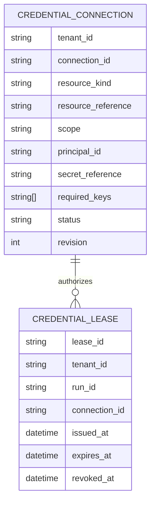
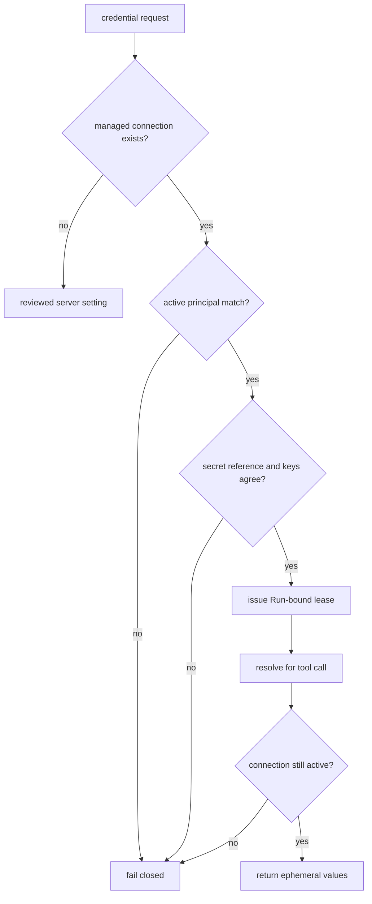
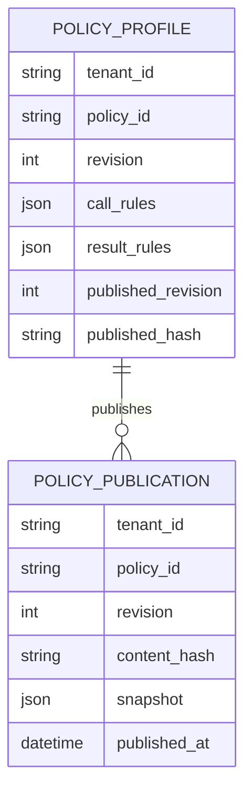
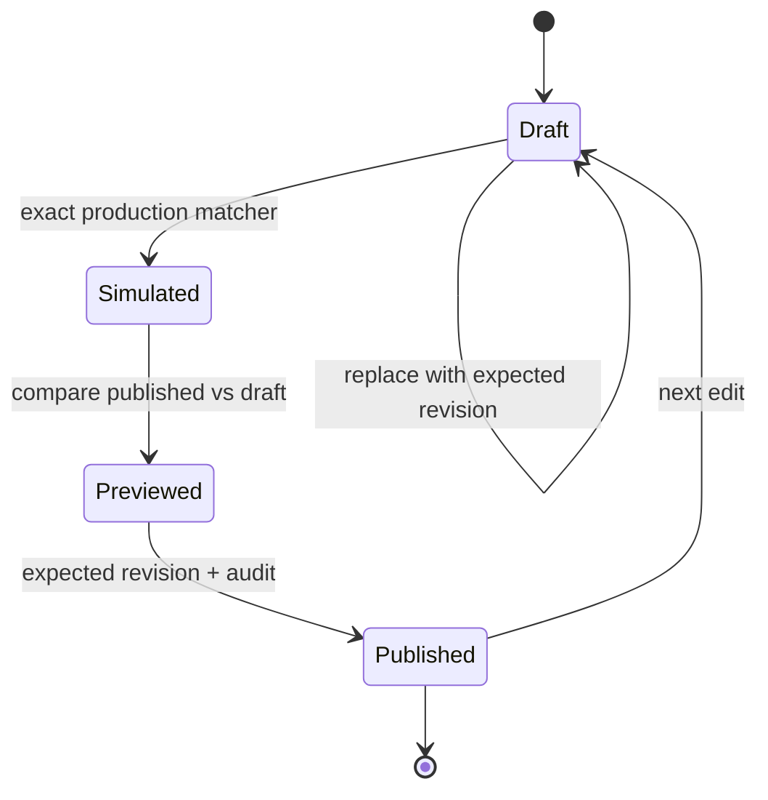

# Phase 5 — delegated credentials and policy control plane

**Branch:** `feature/platform-capability-roadmap`

## Goal

Give Agent Studio an explicit connection and policy control plane without storing secret
values in PostgreSQL, Agent manifests, browser state, prompts, run events or audit payloads.
Every tool call keeps a durable explanation of the policy that governed it, while credential
material remains short-lived and bound to one workload identity and Run.

## Invariants

1. Connection records contain only scope, resource, required key names and an external secret
   reference. Secret values remain in the configured secret provider.
2. Connections are scoped to exactly one personal, team or workload principal.
3. If a resource has managed connections, a caller without a matching active connection fails
   closed. Legacy server-owned settings remain available only for resources with no managed
   connection record.
4. A lease is bound to tenant, Run, resource and connection. It cannot be resolved by another
   Run or tenant.
5. Lease TTL is platform bounded. Revoking a connection invalidates existing leases on their
   next resolution, not only newly issued leases.
6. Tool-call and tool-result policy rules are authored separately.
7. Tool-call decisions are deterministic. No LLM participates in the final allow, ask or deny
   decision.
8. Tool-result trust can only preserve or increase the trust risk declared by the reviewed tool
   catalog. A policy cannot relabel an untrusted result as safe.
9. Draft edits use revision compare-and-set. Publication creates an immutable, content-hashed
   snapshot.
10. Runs resolve one published policy snapshot before execution and use it consistently for SDK
    hooks and fallback runtime events.
11. Simulation and impact preview execute the exact production matchers and precedence rules.
12. Connection mutation and policy publication are audited without secret values or raw tool
    results.

## Connection model

### Scope resolution

For an interactive identity, exact personal connections are preferred over matching team
connections. For a trigger or other workload identity, only an exact workload connection may
match. A resource is considered managed when at least one connection record exists for its
tenant, kind and reference, including revoked records. This prevents revocation from silently
falling back to a server-wide secret.

Team IDs are carried on `ExecutionIdentity`. Existing identities remain compatible through an
empty default. Team membership provisioning is outside this phase, but the authorization
contract is complete and testable.

## Policy model

Each governed profile has a mutable draft and zero or more immutable publications:

### Call rules

Call rules use the existing `PolicyEngine` facts:

- tenant and Agent;
- tool name or glob;
- path glob or command fragment;
- sandbox isolation;
- current context trust;
- priority and deterministic deny-over-ask-over-allow precedence.

No match remains an implicit deny.

### Result rules

Result rules classify a successful tool result as `safe`, `sensitive` or `untrusted`. They use
tool globs, priority, specificity and stable rule-name ordering. The runtime merges the
published classification with the tool catalog declaration using the stricter classification.
The resulting trust state is monotonic for the remainder of the Run and delegated work.

## Authoring and publication

The simulator returns the selected call decision, matched rule and reason plus the selected
result trust and matched result rule. Impact preview accepts explicit representative scenarios
and reports only real decision or trust changes; it does not invent traffic or use an LLM.

Publication requires the caller's expected draft revision. The canonical snapshot is hashed
before persistence. A Run records the policy ID, publication revision and hash it resolved.
Static built-in profiles remain valid fallbacks until a tenant publishes a governed profile
with the same ID.

## Runtime integration

The worker resolves a `ResolvedPolicy` before the Runtime starts. It carries:

- policy ID;
- immutable publication revision and content hash;
- call `PolicyEngine`;
- result `ResultPolicyEngine`.

`RuntimeContext` transports this server-owned object to `SdkToolGate`; it is excluded from
serialization. SDK pre-tool hooks use the resolved call engine. Post-tool hooks use the
resolved result engine and the reviewed tool catalog declaration. Non-SDK/fallback runtime
events use the same resolved call engine in the worker.

Connection authorization happens when MCP/model credentials are requested, not when an Agent
draft is edited. The broker records only safe lease metadata and revalidates the exact
connection on resolve.

## API and Studio

Authenticated Studio endpoints:

- list/create/replace/revoke connections;
- list/create/replace policy drafts;
- simulate a draft;
- preview draft impact against the current publication;
- publish and inspect immutable publications.

The UI is embedded in the existing **运行与权限** section. It uses compact inline rows and a
single detail surface rather than adding a new dashboard, wizard or card grid. The surface
shows:

- connection resource, scope, principal and state;
- external secret reference and required key names, never values;
- call/result rule counts and current publication;
- matched rule explanations in the simulator;
- changed scenarios before publication.

## Failure and rollback

- A mismatched or unavailable secret reference fails before a lease is issued.
- Revoked or expired leases fail on resolve and are removed by maintenance.
- A stale connection or policy edit returns a conflict instead of overwriting a newer revision.
- A stale publication request creates no publication.
- A missing governed publication falls back only to a known static policy profile.
- Migration downgrade is allowed only after governance APIs and runtime resolution are disabled;
  it removes connection metadata and policy snapshots, never secret-provider data.

## Acceptance

- Personal, team and workload connections authorize only their matching execution identities.
- A managed-but-unauthorized or revoked resource never falls back to a shared credential.
- Leases are Run-bound, TTL-bounded, secret-redacted and invalidated by connection revocation.
- Call and result rules use deterministic production matchers and stable precedence.
- Simulation explains matched rules and impact preview compares the actual published snapshot.
- Publication is immutable, hash-bound, revision-protected and audited.
- One Run uses the same published call/result policy in SDK hooks and fallback enforcement.
- Result policy cannot weaken catalog-declared sensitive or untrusted classifications.
- Memory and PostgreSQL repository contracts pass.
- Studio authors connections and policies without exposing secret values.
- Docker Compose migration, API/Web health, real API smoke and dark/light UI checks pass.
