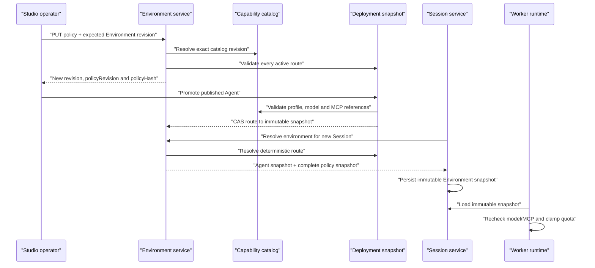

# Phase 2 — Environment resource boundaries

## Decision

Environment is the mutable control-plane object that selects an immutable deployment and a
versioned resource policy. A Session receives a complete immutable copy of that policy at
creation. Runs never consult a mutable Environment after the Session exists.

This preserves two independent revisions:

- `revision` fences every Environment mutation, including route and policy changes;
- `policyRevision` changes only when the resource policy changes.

`policyHash` is the SHA-256 of canonical policy JSON and is derived rather than persisted.

## Resource policy

Each Environment policy pins:

- one reviewed Execution Profile ID and version;
- its reviewed network policy ID, version and allowed access classes;
- the exact capability catalog revision used to validate it;
- allowed primary/fallback model route IDs;
- allowed MCP and knowledge resource references;
- allowed `user`, `team` and `workload` credential scopes;
- maximum per-Run budget, model tokens and Artifact bytes.

Empty MCP and knowledge sets mean deny all. Model routes and credential scopes cannot be empty.
All identifiers are logical platform references; URLs, tokens and provider configuration remain
server-owned.

## Lifecycle

## Update rules

1. Policy replacement requires the current Environment revision.
2. The referenced catalog revision must be current. Catalog drift fails closed until an
   operator reviews and republishes the Environment policy.
3. Production rejects local or non-production Execution Profiles.
4. A policy cannot invalidate any active route. To narrow access, first deploy an Agent that
   fits the narrower boundary and then replace the policy.
5. Deployment creation stores the Environment policy snapshot used for admission.
6. Session creation captures the latest compatible Environment policy; existing Sessions stay
   unchanged.
7. Trigger identities require `workload`; interactive Sessions require `user`.

## Runtime enforcement

- Promotion validates the immutable Agent Manifest against model and MCP allowlists.
- Environment resolution repeats validation so disabled catalog resources fail new Sessions.
- Registry runtime validates the Agent Manifest against the Session snapshot before resolving
  model credentials or tools.
- Run admission uses the minimum of Agent limits and Environment ceilings.
- Artifact publication uses the minimum of the platform maximum and Environment maximum.

These checks are intentionally redundant. Control-plane admission gives early feedback, while
runtime validation protects against stale tasks, persistence corruption and policy drift.

## Persistence and rollback

Environment and Session repositories already persist versioned JSON envelopes. Phase 2 adds
fields to those envelopes and therefore requires no table rewrite or downtime:

- old Environment payloads receive safe default policy fields when read;
- new Environment payloads persist `resourcePolicy` and `policyRevision`;
- new Session payloads persist `environment_snapshot`.

Rollback must first stop new policy writes. Before deploying a binary whose models forbid the
new fields, an operator must strip Phase 2 keys from stored JSON. The current model layer is
forward-compatible, so normal application rollback within this feature branch does not require
a database migration.
