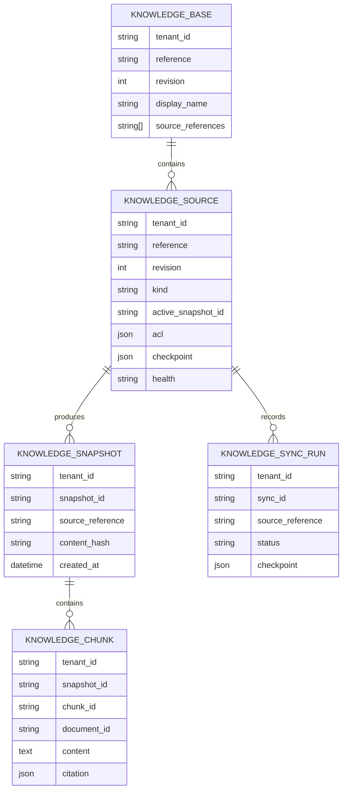
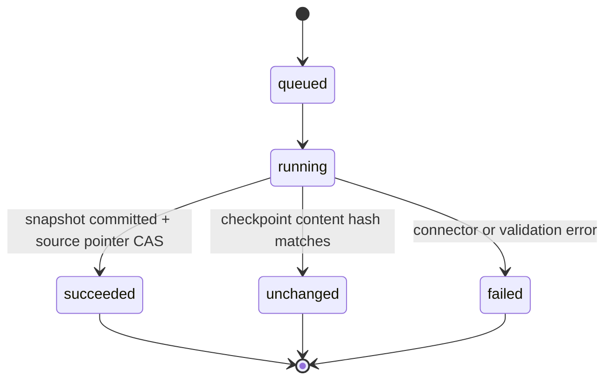
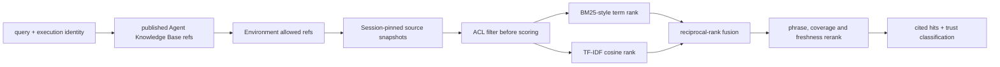

# Phase 4 — governed knowledge sources

**Branch:** `feature/platform-capability-roadmap`

## Goal

Add a versioned, permission-aware knowledge plane without weakening the current Agent
release, Environment, Session, policy or audit boundaries. Knowledge is organizational
reference material, not user memory and not mutable Agent bundle content.

The first production-shaped slice supports managed text files and reviewed Web pages. GitHub
and enterprise systems use the same connector contract later.

## Invariants

1. Agent Manifests contain only stable Knowledge Base references. They never contain source
   credentials, local host paths, arbitrary connector headers or indexed document bodies.
2. A published Agent may only reference Knowledge Bases that exist in the tenant.
3. Promotion fails when an Agent Knowledge Base is outside the target Environment's
   `allowedKnowledgeReferences`.
4. Every successful connector sync creates an immutable snapshot. Existing Sessions keep the
   snapshot set resolved at Session creation.
5. Permission filtering happens before any candidate receives a retrieval score.
6. Every hit contains an inspectable citation with Knowledge Base, source, snapshot, document,
   URI and chunk identifiers.
7. File results are `sensitive`; Web results are `untrusted`. The existing deterministic
   tool-result trust state remains authoritative for later tool calls and delegation.
8. Connector checkpoints update only after the new snapshot and all chunks commit.
9. Failed syncs do not replace the active snapshot.
10. Search and sync are bounded, auditable and tenant scoped.

## Domain model

### Knowledge Base

A stable logical reference assigned to Agents and Environments. It contains an ordered,
deduplicated set of source references and uses revision compare-and-set for edits.

### Knowledge Source

A connector instance. Phase 4 initially supports:

- `file`: one or more UTF-8 text/Markdown documents supplied through the authenticated API;
- `web`: one reviewed HTTPS URL, fetched through an SSRF-safe connector with bounded redirects,
  response bytes and content types.

Its ACL is either tenant-wide or restricted to explicit user/workload identifiers. Team ACLs
will reuse Phase 5 connection/team identity rather than introducing a second team model here.

### Snapshot and chunks

A sync produces a canonical source snapshot and deterministic chunks. The snapshot hash covers
document identity, source URI, title, content hash and chunk hashes. Old snapshots remain
queryable for Sessions that already pinned them.

## Sync lifecycle

The connector returns documents and a next checkpoint. The service normalizes documents,
chunks them deterministically, persists an immutable snapshot and then atomically advances the
source active pointer. A compare-and-set conflict leaves the new snapshot unreferenced and
reports a retryable conflict; it never overwrites a newer sync.

## Retrieval

The initial vector signal is local TF-IDF rather than a falsely advertised semantic embedding.
The adapter boundary permits a reviewed embedding/reranking provider later without changing
the permission, snapshot or citation contracts.

## Runtime surface

An Agent with at least one Knowledge Base receives one platform tool:

`query_knowledge_sources(query, limit)`

The tool cannot accept arbitrary Knowledge Base references. It searches only references from
the published Manifest, intersected with the Environment snapshot and resolved to the
Session-pinned snapshot set. Local execution uses an SDK MCP server; remote CLI execution uses
an authenticated Streamable HTTP MCP endpoint with a five-minute, purpose-bound workload token.

The target tool is declared `sensitive` when all reachable sources are managed files and
`untrusted` when any reachable source is Web content. This classification enters the existing
`SdkToolGate` result-trust state.

## API and Studio

Authenticated endpoints:

- list/create/replace Knowledge Bases;
- list/create/replace sources;
- start and inspect syncs;
- query with the current user identity for preview;
- inspect active and historical snapshots.

Studio's Data area becomes a governed Knowledge surface. It shows Knowledge Bases first, source
health and last sync inline, and connector details progressively. Agent Studio adds a compact
Knowledge Base binding control beside tools; it does not add another wizard or page-level card
grid.

## Failure and rollback

- Invalid source content, unsafe Web targets, oversized responses and unsupported media types
  fail before snapshot publication.
- A failed refresh keeps the previous healthy snapshot active and marks source health degraded.
- Removing a source from a Knowledge Base affects new Sessions only; existing pinned Sessions
  remain reproducible.
- Migration downgrade removes Phase 4 relational rows only after Knowledge APIs and runtime
  attachment are disabled.

## Acceptance

- File and Web connectors create immutable snapshots and checkpoint unchanged content.
- Restricted source content is absent before retrieval scoring for an unauthorized identity.
- Search returns stable citations and deterministic ordering.
- Published Agent and Environment boundaries reject unknown or disallowed Knowledge Bases.
- Session creation pins the exact source snapshots and later syncs do not change that Session.
- Local and remote runtime tools cannot search an undeclared base.
- File results become sensitive and Web results untrusted in tool-result policy state.
- Memory and PostgreSQL repositories pass equivalent contract tests.
- Studio can manage sources, sync them and bind a Knowledge Base without exposing secrets.
- Docker Compose migration, API/Web health, real API smoke and dark/light UI checks pass.
