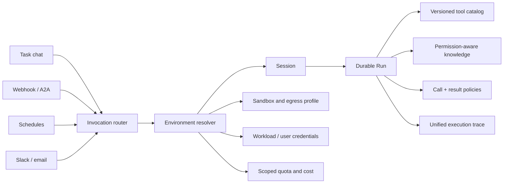

# Agent Studio platform capability roadmap

**Branch:** `feature/platform-capability-roadmap`

**Goal:** evolve Agent Studio from a governed Agent build-and-run workbench into a
reusable organizational Agent platform without weakening immutable releases, deterministic
policy enforcement, sandbox isolation, durable Runs, evaluations, or promotion gates.

## Product principles

1. One published Agent version may be invoked from multiple channels, but every invocation
   converges on the existing `Session -> Run -> Event -> Artifact` contract.
2. Deployment environments remain the authority for selecting an immutable Agent snapshot.
   Triggers never point at `latest`.
3. Tools may be discovered lazily only inside a versioned, server-reviewed capability set.
4. User and workload credentials are resolved at execution time and never stored in Agent
   bundles, trigger records, prompts, events, or browser configuration.
5. Knowledge retrieval is permission-filtered before ranking and always returns inspectable
   source references.
6. Policy decisions stay deterministic. LLMs may suggest policies but cannot be the final
   enforcement mechanism.
7. Every asynchronous action is idempotent, cancellable where meaningful, auditable, and
   attributable to tenant, user/workload, Agent, environment, deployment snapshot and Trace.

## Target architecture

## Delivery phases

### Phase 1 — published Agent triggers

Deliver a reusable invocation surface over the current production runtime.

- Tenant-scoped Trigger records bound to `agent_name + environment`.
- Webhook trigger creation, list, enable/disable and secret rotation.
- High-entropy secrets returned once; only SHA-256 digests are persisted.
- Public invocation endpoint protected by the trigger secret.
- Required `Idempotency-Key`; retries converge on one Session and Run.
- Environment resolution pins the current deployment snapshot when the Session is created.
- Trigger invocation reuses Run admission, queueing, streaming events, cancellation,
  approvals, artifacts, quality hooks and observability.
- Trigger actor is a workload identity (`trigger:<trigger_id>`), not an impersonated user.
- Studio shows endpoint, state, environment, last invocation and one-time secret handoff.

Acceptance:

- an enabled trigger with a valid secret creates one queued Run;
- the same idempotency key and payload returns the same Session and Run;
- the same key with a different payload fails closed;
- disabled triggers and invalid secrets return indistinguishable authorization failures;
- an environment without a healthy deployment cannot be invoked;
- secret rotation immediately invalidates the old secret;
- no plaintext secret appears in persistence or API list responses;
- memory and PostgreSQL repositories pass equivalent contract tests.

### Phase 2 — environment resource boundaries

Promote Environment from a deployment route into a platform boundary:

- versioned execution/network profile;
- allowed model routes and capability catalog revision;
- allowed MCP and knowledge resources;
- credential scope;
- quota/cost policy;
- immutable environment snapshot attached to each Session.

### Phase 3 — load tools when needed

- Publish a tool-directory snapshot with each Agent version.
- Expose small `search_tools` and `run_tool` runtime tools.
- Search only the pinned directory and environment-visible subset.
- Load the full schema only at invocation time.
- Apply the target tool's real policy, credential and audit identity.

### Phase 4 — governed knowledge sources

- Knowledge bases, connectors, checkpointed incremental sync and source health.
- File/web first, then GitHub and enterprise connectors.
- Permission filtering before retrieval, hybrid search, reranking and citations.
- Knowledge results classified through the existing trust-state model.

### Phase 5 — delegated credentials and policy control plane

- Personal, team and workload connection scopes.
- Short-lived credential leases and revocation.
- Separate tool-call and tool-result policy authoring.
- Policy simulator, impact preview, matched-rule explanation and audited publication.

### Phase 6 — platform operations and interoperability

- In-product Lead/Sub execution graph with latency, token, cost and failure attribution.
- Organization/team/user/Agent/environment/key budgets and alerts.
- A2A Agent Cards and streaming task interoperability.
- Scheduled and chat-ops triggers.
- Guarded platform-management MCP for administrative automation.

## Explicit non-goals

- No automatic access to every tool visible to a user.
- No mutable `latest` deployment binding.
- No arbitrary MCP URL or credential in a draft.
- No plaintext trigger secret recovery.
- No nested delegation until per-Sub identity, credential, network, Artifact, cost and
  cancellation propagation are proven.
- No Kubernetes MCP orchestration requirement for the first four phases.

## Migration and rollback

Phase 1 adds `agent_triggers`. It contains public metadata and a one-way secret digest.
Rollback disables the public route first, then drops the table through the Alembic downgrade.
Existing Sessions, Runs, deployments and Agent packages are unchanged.
