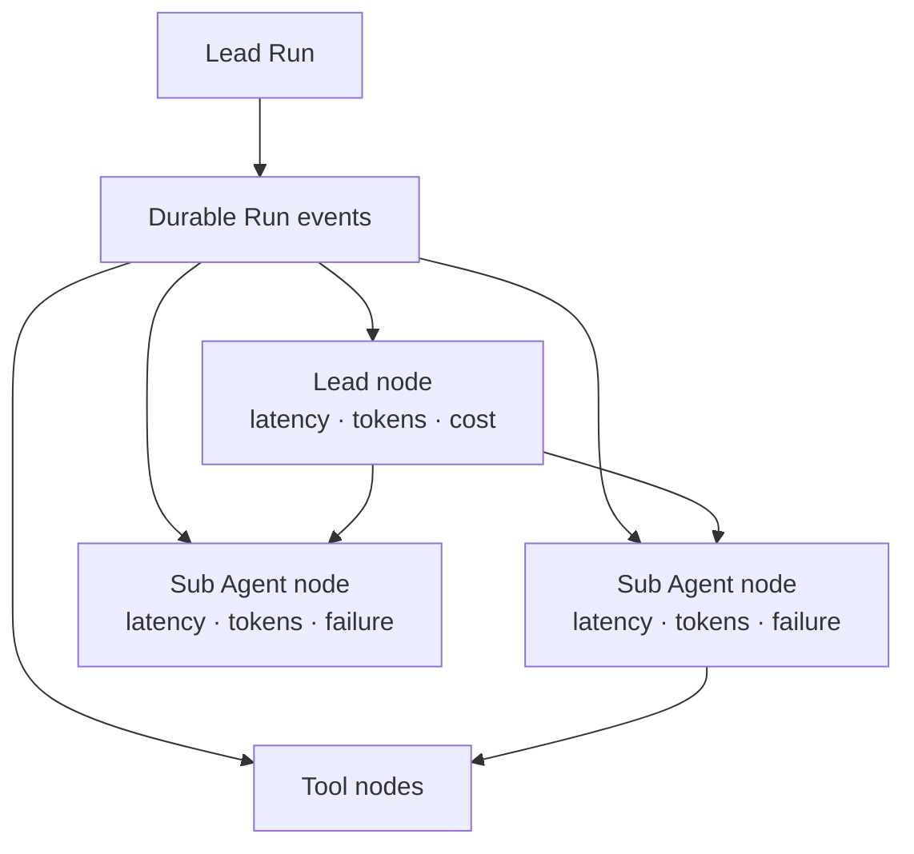
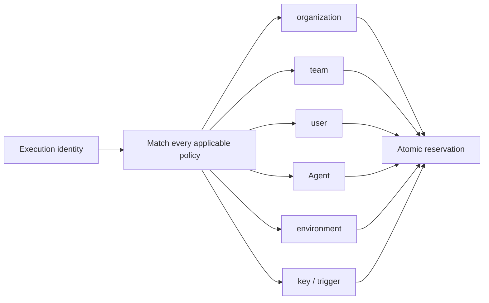

# Phase 6 — platform operations and interoperability

**Branch:** `feature/platform-capability-roadmap`

## Goal

Make the existing Agent Studio runtime operable as an organizational platform without
introducing a second execution lifecycle. Interactive tasks, A2A calls, schedules and ChatOps
events all resolve an immutable deployment and converge on the same
`Session -> Run -> Event -> Artifact` contract.

## Invariants

1. A Run remains the only executable task record. A2A tasks and trigger deliveries are
   projections or adapters, never parallel state machines.
2. Execution graphs are rebuilt from durable Run events. The browser does not invent timing,
   token, cost or failure facts.
3. Every matching budget applies. A narrower team, user, Agent, environment or key policy
   cannot replace a stricter organization policy.
4. Budget admission and accounting use the same immutable scope carried by a reservation.
5. Alerts are derived from committed and reserved counters and are idempotent per
   scope/resource/window/threshold.
6. A2A 1.0 tasks are server-generated Run IDs. A2A context IDs are deterministic Session IDs.
7. A2A streaming uses ordered durable event cursors and supports reconnect; disconnecting a
   client never cancels its Run.
8. Schedule retries use `trigger_id + scheduled_at` as their idempotency key. A lease/CAS
   prevents multiple schedulers from creating duplicate Runs.
9. ChatOps adapters accept normalized, authenticated events. Provider-specific signatures are
   verified before the normalized invocation service is called.
10. Platform-management MCP is read-only by default. Identity is server-issued and cannot be
    supplied in tool arguments.
11. Administrative MCP mutations, when explicitly enabled, require an administrator role,
    expected revision, governed policy approval and an audit record.

## Runtime and execution graph

`runtime.result` supplies Lead turns, token usage and cost. `subagent.*` terminal events supply
Sub latency, token usage, tool count and failure attribution. Missing provider cost remains
unknown rather than being estimated. The existing task ribbon becomes the graph surface; no
separate operations dashboard is introduced.

## Multi-dimensional budgets

`QuotaScope` gains optional organization, team, user, Agent, environment and API-key
dimensions. Tenant is the organization boundary, so `organizationId` is informative and must
equal the current tenant when present.

Policies with multiple fields are conjunctive. Matching policies produce independent
constraints, sorted by canonical scope key before row locks are acquired. A reservation stores
the complete dimensions so commit, release and reconciliation cannot drift from admission.

Alert rules use threshold percentages and one of `info`, `warning` or `critical`. Evaluation
is pure and deterministic over quota counters. An alert instance is keyed by
`scope + resource + window + threshold`, making repeated reconciliation idempotent.

## A2A 1.0 adapter

The first binding is the official A2A 1.0 HTTP+JSON binding:

- an Agent Card advertises `HTTP+JSON`, protocol `1.0`, Bearer authentication and streaming;
- `POST /message:send` creates or reuses a Run from `messageId`;
- `POST /message:stream` creates the same Run and streams status/artifact updates;
- `GET /tasks/{id}` projects one authorized Run;
- `POST /tasks/{id}:cancel` calls the existing cancellation service;
- `POST /tasks/{id}:subscribe` streams ordered updates for a non-terminal Run.

Hosted platforms may serve many Agents on one domain, so Studio exposes a direct/registry
Agent Card URL per A2A trigger instead of publishing one ambiguous domain-wide card. This is
the A2A direct-configuration discovery mode. The card contains no secret or internal tool
inventory.

Run states map as follows:

| Run | A2A task state |
| --- | --- |
| queued / provisioning / running / cancelling | `TASK_STATE_WORKING` |
| waiting_approval | `TASK_STATE_AUTH_REQUIRED` |
| succeeded | `TASK_STATE_COMPLETED` |
| failed / timed_out | `TASK_STATE_FAILED` |
| cancelled | `TASK_STATE_CANCELED` |
| rejected | `TASK_STATE_REJECTED` |

Artifacts use authenticated Harness download URLs. Prompt parts support text only in this
phase; unsupported media fails before a Run is created.

## Scheduled and ChatOps triggers

Trigger kind becomes `webhook | a2a | schedule | chatops`.

- A schedule stores an IANA timezone, interval in seconds, prompt and `nextFireAt`.
- The scheduler atomically claims due triggers, invokes through the same trigger service and
  advances from the scheduled instant, not wall-clock completion.
- A ChatOps trigger stores provider and optional channel allowlist. Its public adapter accepts
  normalized `messageId`, `channelId`, `threadId`, actor and text after authentication.
- All kinds resolve the current environment deployment only when creating a new Session.
- Trigger metadata is attached to Run input for audit and quota key attribution.

## Guarded platform-management MCP

The mounted MCP surface exposes compact read operations:

- `list_agents`;
- `list_environments`;
- `get_quota_usage`;
- `list_governed_policies`;
- `simulate_tool_policy`.

The server issues short-lived workload tokens containing tenant, user, roles and purpose.
Tools never accept tenant or role arguments. The default server has no mutation tools.
`HARNESS_PLATFORM_MCP_MUTATIONS_ENABLED=true` may register narrowly scoped CAS mutation tools,
but production also requires administrator RBAC, governed call-policy approval and audit.

## Failure, rollout and rollback

- Unsupported A2A versions return a version error before authentication-dependent data leaks.
- Invalid/disabled trigger credentials remain indistinguishable.
- A duplicate schedule claim or ChatOps delivery converges on the same Run.
- A stale trigger update or quota policy update returns conflict.
- Unknown model cost remains visible and cannot silently satisfy a cost alert.
- Migration `0019` is additive. Older JSON payloads read with empty new scope fields and
  webhook trigger defaults.
- Rollback first disables A2A/scheduler/ChatOps routes and platform MCP, then downgrades
  additive trigger scheduling and budget-alert persistence.

## Acceptance

- Lead/Sub graph shows latency, tokens, cost where known and exact failure attribution.
- Organization, team, user, Agent, environment and key policies all participate in atomic
  admission.
- Threshold alerts are deterministic, idempotent and visible with usage.
- A2A Card, send, get, cancel and SSE subscribe interoperate through one Harness Run.
- Scheduled retries and duplicate ChatOps messages create no duplicate Runs.
- Platform MCP exposes no mutation by default and cannot accept caller-selected identity.
- Memory and PostgreSQL repository contracts pass.
- Docker Compose migration, service health, real API/A2A/schedule/MCP smoke and dark/light UI
  checks pass.
