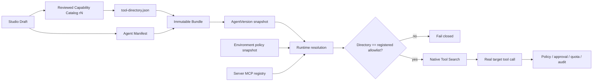
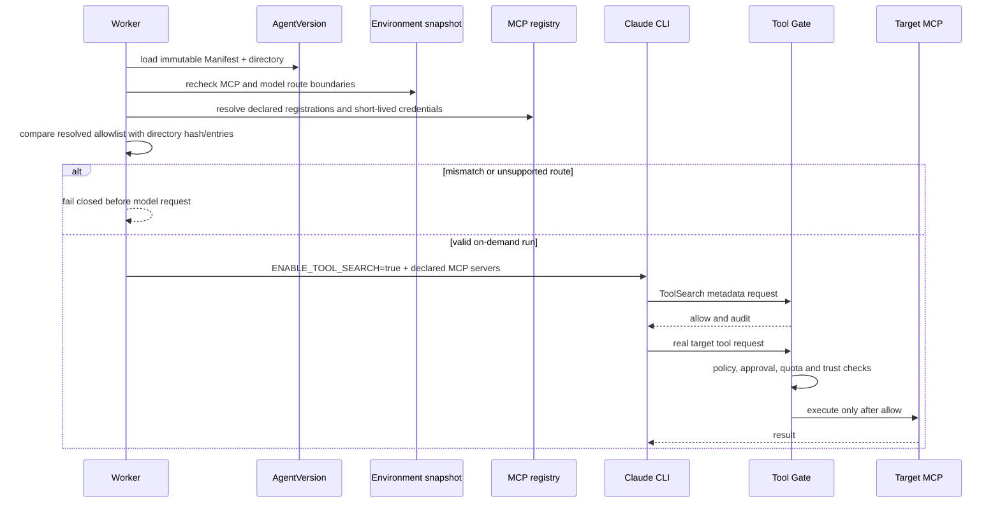

# Phase 3 — versioned tool directory and load-on-demand

## Goal

Reduce tool-schema context cost without widening an Agent's published capability set.
An Agent may opt into load-on-demand only when its model route has been reviewed for
native Tool Search. Search and the eventual target call must remain inside the immutable
Manifest, Environment snapshot, policy, credential, quota and audit boundaries.

## Decisions

1. `toolExposureMode` is versioned in the Agent Manifest and is either `eager` or
   `on_demand`. Existing Manifests default to `eager`.
2. Studio emits `tool-directory.json` into every new Bundle. The directory contains
   reviewed names and descriptions, not credentials or mutable endpoints.
3. The directory is tied to the Capability Catalog revision, has a canonical SHA-256
   hash, is included in the Agent content hash and is persisted in `AgentVersion.snapshot`.
4. Claude Agent SDK uses the Claude CLI native Tool Search path. The search operation
   discovers a deferred MCP tool; the selected tool is then invoked by its real name.
   We deliberately do not wrap execution in a generic Python `run_tool`, because that
   would bypass the target tool's SDK Hook identity and would not work in a remote
   Daytona transport.
5. The published directory is authoritative. Before starting the model, runtime requires
   the registered MCP allowlist to exactly match the MCP entries in the directory.
6. `on_demand` requires the model route capability `tool_search`. Unsupported routes
   fail validation and runtime resolution; there is no silent eager fallback.
7. Tool Search itself is safe metadata access. The discovered target call still passes
   through the existing deterministic policy, approval, quota, trust-state and trace
   pipeline under the target tool name.
8. Built-in workspace tools remain eager. They are small, execute in the selected
   Sandbox, and should be immediately available for file-oriented tasks.

## Published contract



`tool-directory.json`:

```json
{
  "schemaVersion": "harness.tool-directory/v1",
  "catalogRevision": 7,
  "exposureMode": "on_demand",
  "entries": [
    {
      "name": "mcp__tavily__tavily_search",
      "source": "mcp",
      "logicalReference": "tavily-readonly",
      "description": "Search public web sources through the reviewed Tavily MCP.",
      "risk": "medium",
      "resultTrust": "untrusted"
    }
  ],
  "contentHash": "<canonical sha256>"
}
```

The file contains no URL, header, token, environment value or user connection.

## Runtime sequence



## Studio interaction

The capability section keeps one hierarchy:

- selected workspace and MCP capabilities;
- one inline "tool loading" summary directly above MCP capabilities;
- `eager` and `on_demand` as a compact segmented choice;
- route compatibility, directory entry count and the next published catalog revision
  shown as facts, not as another card grid;
- an inline blocking explanation when the selected route lacks `tool_search`.

The default stays `eager`. Small tool sets do not pay an extra discovery turn unless the
builder explicitly opts in.

## Acceptance

- a Studio Bundle contains a deterministic `tool-directory.json`;
- Bundle extraction validates the directory hash and Manifest exposure mode;
- an existing Bundle without a directory remains readable only in `eager` mode;
- `on_demand` without a directory or route capability is rejected;
- runtime rejects a registered MCP allowlist that is wider or narrower than the pinned
  directory;
- `on_demand` sets native Tool Search for local and remote Claude CLI transports;
- the target MCP call still produces target-name policy, approval, quota and trace facts;
- the directory and runtime events contain no credentials or endpoint configuration;
- Studio shows compatibility and preserves light/dark theme behavior;
- unit, API integration, runtime transport, frontend and production build checks pass.

## Implementation status

Implemented on `feature/platform-capability-roadmap`:

- immutable Manifest and Bundle directory schema with canonical hash validation;
- Catalog revision pinned into the directory and rechecked by deployment and runtime
  Environment boundaries;
- Studio authoring and API round-trip for `eager` / `on_demand`;
- native Tool Search activation only on reviewed routes;
- runtime exact-match enforcement for built-in tools and MCP target names;
- safe directory observability facts without endpoints or credentials.

Verification evidence is recorded in the feature commit and local Compose deployment
smoke checks rather than embedded as mutable timestamps in this design contract.

## Rollback

Set new Drafts to `eager` and stop emitting `tool-directory.json`. Existing published
versions remain readable because `toolExposureMode` and the directory are inside their
immutable snapshots. Runtime must continue honoring `on_demand` for already deployed
versions until those deployments are rolled back or replaced.
